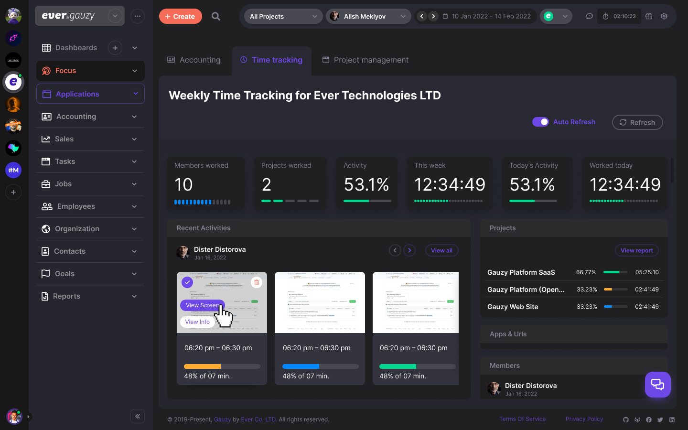

<!-- generated -->

# Ever Gauzy

1-Click installation template for Ever Gauzy on Easypanel

## Description

Ever Gauzy is an open business management platform covering ERP CRM HRM ATS and project management with time tracking invoicing and reporting. This template deploys the official API web UI and PostgreSQL stack similar to the upstream docker compose demo layout.

## Instructions

Deploy and wait for PostgreSQL the API and the web UI to become healthy. Open the web service URL shown in Easypanel. Register yourself and complete the wizard to start using the application.

## Benefits

- All in One Operations: Combines HR CRM projects time tracking and financial workflows in one platform.
- Open Source AGPL: Source available platform you can audit extend and host yourself.
- PostgreSQL Metadata: Persists application data in a managed PostgreSQL service with generated credentials.

## Features

- Time and Activity Tracking: Track employee time activity and productivity with timesheets and related workflows.
- CRM and Sales: Manage contacts pipelines proposals and customer relationships.
- Projects and Tasks: Organize work with projects tasks goals and team coordination.
- Invoicing and Accounting: Supports estimates invoices payments and expense oriented workflows.

## Links

- [Website](https://gauzy.co/)
- [Documentation](https://docs.gauzy.co/)
- [GitHub](https://github.com/ever-co/ever-gauzy)
- [Template Source](https://github.com/easypanel-io/templates/tree/main/templates/ever-gauzy)

## Options

Name | Description | Required | Default Value
-|-|-|-
App Service Name | - | yes | ever-gauzy
Gauzy API Image | - | yes | ghcr.io/ever-co/gauzy-api:latest
Gauzy Web Image | - | yes | ghcr.io/ever-co/gauzy-webapp:latest

## Screenshots

## Change Log

- 2026-04-03 – Initial template with PostgreSQL Gauzy API and Gauzy web UI

## Contributors

- [Ahson Shaikh](https://github.com/Ahson-Shaikh)
