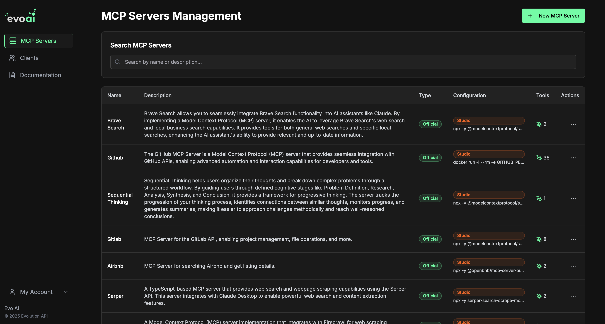

<!-- generated -->

# Evo AI

1-Click installation template for Evo AI on Easypanel

## Description

AI-powered API platform for conversational applications

## Instructions

Use admin email - admin@evoai.com and configure the password.

## Benefits

- AI Conversation Platform: Build intelligent conversational applications with ease.
- Scalable Architecture: Designed to scale with your application's needs.
- Comprehensive API: Access powerful AI capabilities through a simple API interface.

## Features

- Conversational AI: Natural language processing and generation capabilities.
- User Authentication: Secure JWT-based authentication system.
- Email Integration: SendGrid integration for email communications.
- Data Persistence: PostgreSQL database for reliable data storage.
- Caching: Redis caching for improved performance.
- Web Interface: User-friendly frontend for interacting with the AI platform.

## Links

- [Website](https://evoai.co/)
- [Documentation](https://docs.evoai.co/)
- [GitHub](https://github.com/EvolutionAPI/evo-ai)
- [Template Source](https://github.com/easypanel-io/templates/tree/main/templates/evo-ai)

## Options

Name | Description | Required | Default Value
-|-|-|-
Service Name | - | yes | evo-ai
API Service Image | - | yes | evoapicloud/evo-ai:0.1.0
Frontend Image | - | yes | evoapicloud/evo-ai-frontend:v0.0.7
Admin Initial Password | - | yes | admin123
SendGrid API Key | - | no | 
Email From Address | - | no | noreply@example.com

## Screenshots

## Change Log

- 2025-05-27 – First release

## Contributors

- [Ahson Shaikh](https://github.com/Ahson-Shaikh)
