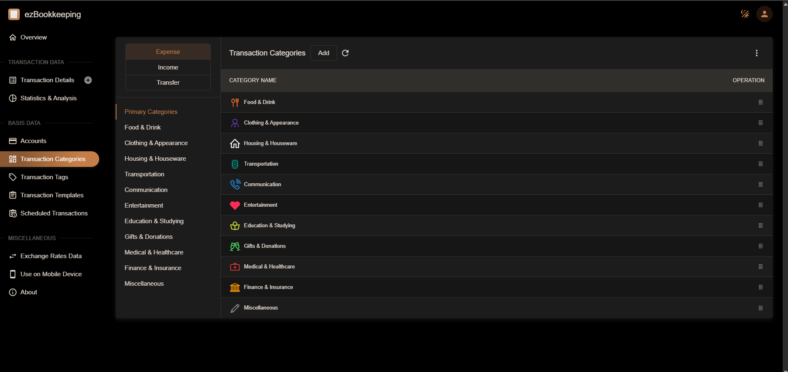
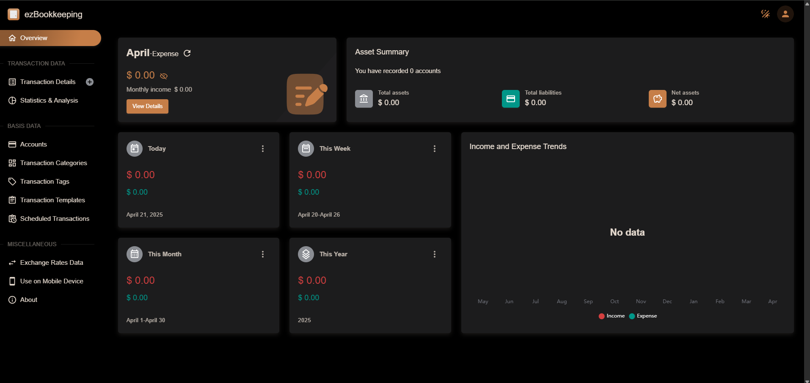

<!-- generated -->

# ezBookkeeping

1-Click installation template for ezBookkeeping on Easypanel

## Description

ezBookkeeping is a simple and easy-to-use personal bookkeeping application that helps you manage your personal finances. It provides features for tracking income, expenses, and account balances.

## Benefits

- Personal Finance Management: Track and manage your personal finances with ease.
- Simple Interface: User-friendly interface for managing income and expenses.
- Data Persistence: Secure storage of your financial data with volume mounts.
- Easy Setup: Quick and simple setup process for personal bookkeeping.
- Open Source: Free and open-source personal finance management solution.

## Features

- Income Tracking: Record and categorize your income sources.
- Expense Management: Track and categorize your expenses.
- Account Balances: Monitor your account balances and financial health.
- Data Export: Export your financial data for backup or analysis.
- Multi-Currency Support: Support for multiple currencies in your financial records.

## Links

- [Github](https://github.com/mayswind/ezbookkeeping)
- [Documentation](https://github.com/mayswind/ezbookkeeping/wiki)
- [Template Source](https://github.com/easypanel-io/templates/tree/main/templates/ezbookkeeping)

## Options

Name | Description | Required | Default Value
-|-|-|-
App Service Name | - | yes | ezbookkeeping
App Service Image | - | yes | mayswind/ezbookkeeping:SNAPSHOT-20260429

## Screenshots

## Change Log

- 2025-04-21 – First Release
- 2026-04-29 – Version bumped to SNAPSHOT-20260429

## Contributors

- [Ahson Shaikh](https://github.com/Ahson-Shaikh)
