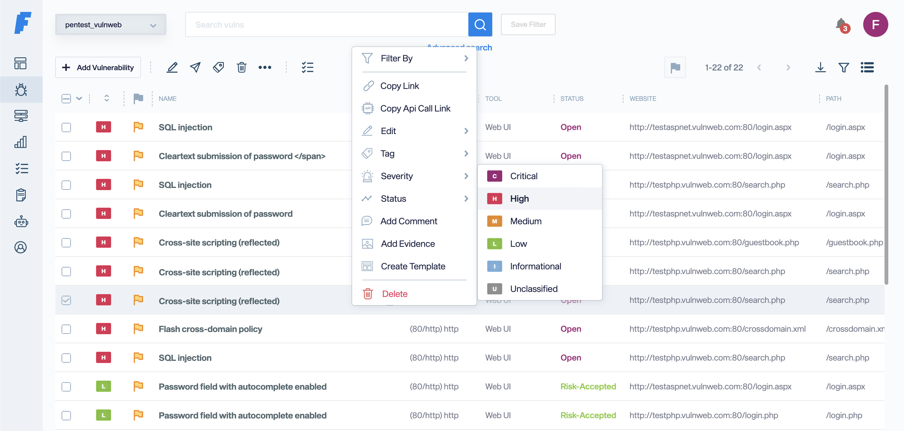

<!-- generated -->

# Faraday

1-Click installation template for Faraday on Easypanel

## Description

Faraday is a powerful open-source vulnerability management platform designed to streamline security assessments and pentesting workflows. It provides centralized visibility, real-time collaboration, and automation capabilities to help security teams manage vulnerabilities efficiently. Faraday supports integration with multiple security tools, offering a unified interface to collect, analyze, and report findings. With its scalable architecture and robust API, Faraday enables teams to enhance their security operations while maintaining compliance and improving response times.

## Instructions

Username is faraday; check for the password in the Overview Console logs.

## Benefits

- Centralized Vulnerability Management: Faraday provides a unified platform for managing security assessments, allowing teams to track and remediate vulnerabilities effectively.
- Real-Time Collaboration: Enable security teams to work together efficiently with shared workspaces, real-time updates, and collaborative issue tracking.
- Extensive Integrations: Faraday integrates with a wide range of security tools, including vulnerability scanners, exploit frameworks, and reporting systems.
- Automated Workflows: Automate vulnerability management tasks, including data collection, correlation, and reporting, to improve efficiency.
- Scalable & Flexible: Faraday supports deployments for teams of any size, from small security groups to enterprise-level security operations centers (SOCs).

## Features

- Multi-Tool Integration: Collect data from various security tools, normalizing and aggregating findings for streamlined analysis.
- Interactive Dashboard: Gain insights into security assessments with an interactive, data-driven dashboard providing real-time analytics.
- Customizable Reporting: Generate detailed security reports with customizable templates and automated data correlation.
- API & Web Interface: Extend functionality with a powerful REST API and manage security assessments via an intuitive web interface.
- Role-Based Access Control (RBAC): Implement granular permissions and access controls for managing users and teams securely.
- Compliance & Risk Management: Track vulnerabilities and ensure compliance with security standards such as PCI-DSS, ISO 27001, and NIST.

## Links

- [Website](https://www.faradaysec.com/)
- [Documentation](https://docs.faradaysec.com/)
- [Github](https://github.com/infobyte/faraday)
- [Template Source](https://github.com/easypanel-io/templates/tree/main/templates/faraday)

## Options

Name | Description | Required | Default Value
-|-|-|-
App Service Name | - | yes | faraday
App Service Image | - | yes | faradaysec/faraday:5.10.1

## Screenshots

## Change Log

- 2025-01-30 – First release

## Contributors

- [Ahson Shaikh](https://github.com/Ahson-Shaikh)
