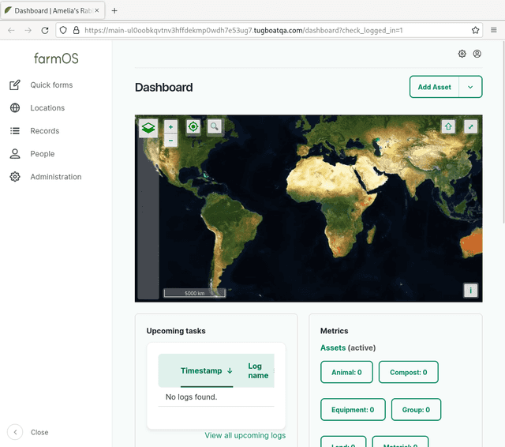

<!-- generated -->

# farmOS

1-Click installation template for farmOS on Easypanel

## Description

farmOS is a web-based farm management and record-keeping platform built on Drupal. It helps track assets, logs, plans, and maps for agricultural operations while remaining fully self-hosted and extensible.

## Instructions

After deployment, open your domain and complete the farmOS web installer. In the database step, choose SQLite and use a database file path under `sites/default/files` so it remains persistent. This template persists the farmOS `sites` and `keys` directories for settings, uploaded files, SQLite database storage, and key material across upgrades.

## Benefits

- Purpose-built for farm records: Track assets, field activities, equipment, and observations in one centralized system designed for agricultural workflows.
- Open-source and extensible: Build on Drupal's ecosystem with modules, integrations, and custom data models tailored to your farm operations.
- Self-hosted data ownership: Keep sensitive operational data under your control while still providing a modern, web-based management interface.

## Features

- Asset and log management: Create structured records for fields, animals, equipment, and operational events with reusable log types.
- Mapping and planning tools: Organize locations, plans, and timelines to support seasonal planning and day-to-day execution.
- Persistent application state: Persists `sites` and `keys` directories so uploads, configuration, and key files survive container updates.

## Links

- [Website](https://farmos.org/)
- [Documentation](https://farmos.org/hosting/install/)
- [Github](https://github.com/farmOS/farmOS)
- [Docker Hub](https://hub.docker.com/r/farmos/farmos)
- [Template Source](https://github.com/easypanel-io/templates/tree/main/templates/farmos)

## Options

Name | Description | Required | Default Value
-|-|-|-
App Service Name | - | yes | farmos
App Service Image | - | yes | farmos/farmos:4.0.0

## Screenshots

## Change Log

- 2026-04-13 – Initial template release

## Contributors

- [Ahson Shaikh](https://github.com/Ahson-Shaikh)
