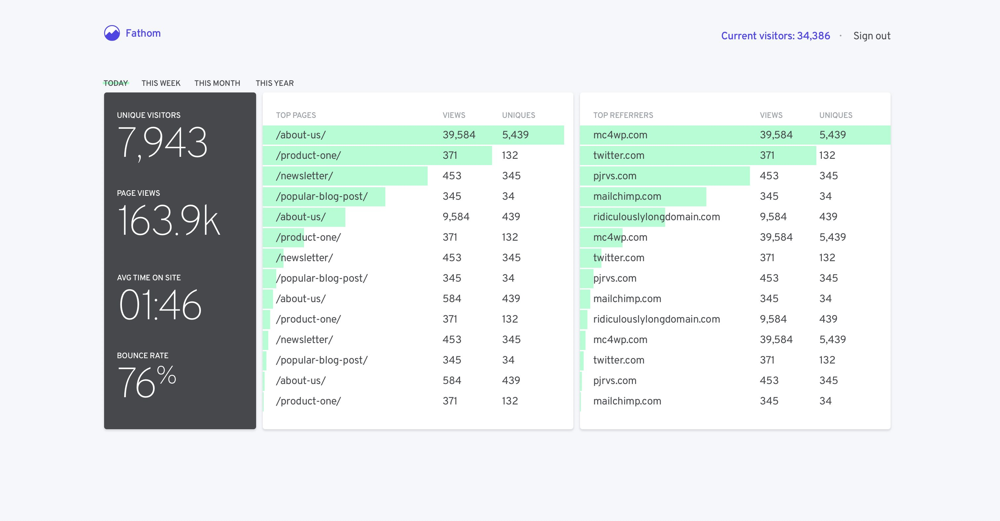

<!-- generated -->

# Fathom

1-Click installation template for Fathom on Easypanel

## Description

Fathom is a simple, privacy-focused alternative to Google Analytics. It provides fast, lightweight and privacy-first website analytics without compromising user data.

## Instructions

Open Fathom from your domain, complete the initial admin setup, then add your website and embed the generated tracking script in your site pages.

## Benefits

- Privacy-Focused: No personal data collection, GDPR compliant by default
- Lightning Fast: Lightweight script that won't slow down your website
- Simple Interface: Clean, intuitive dashboard for easy analytics tracking
- Cookie-Free: Track website stats without cookie banners or popups

## Features

- Real-Time Analytics: View your website statistics in real-time
- Multiple Sites: Track analytics for multiple websites from one dashboard
- Custom Domains: Use your own domain for the tracking script
- Goal Tracking: Set up and monitor custom goals and events
- Data Export: Export your analytics data in various formats

## Links

- [Website](https://usefathom.com)
- [Documentation](https://usefathom.com/docs)
- [GitHub](https://github.com/usefathom/fathom)
- [Template Source](https://github.com/easypanel-io/templates/tree/main/templates/fathom)

## Options

Name | Description | Required | Default Value
-|-|-|-
App Service Name | - | yes | fathom
App Service Image | - | yes | usefathom/fathom:version-1.2.1

## Screenshots

## Change Log

- 2024-04-08 – First Release

## Contributors

- [Ahson Shaikh](https://github.com/Ahson-Shaikh)
