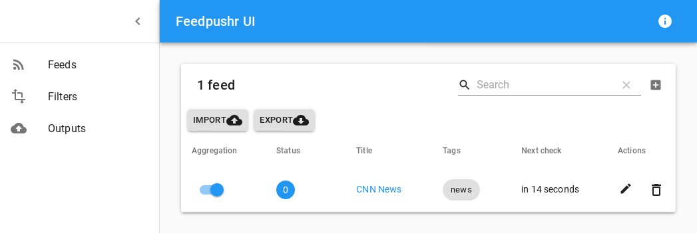

<!-- generated -->

# Feedpushr

1-Click installation template for Feedpushr on Easypanel

## Description

Feedpushr is a simple and fast RSS/Atom feed aggregator that can push notifications to various services. It supports multiple output formats and can be used to monitor and aggregate RSS/Atom feeds.

## Benefits

- Simple Feed Aggregation: Feedpushr provides a simple way to aggregate RSS/Atom feeds and push notifications to various services.
- Multiple Output Formats: Supports multiple output formats and can be integrated with various notification services.
- Easy to Use: Simple configuration and easy to set up, making it perfect for monitoring and aggregating feeds.

## Features

- RSS/Atom Support: Supports both RSS and Atom feed formats for comprehensive feed aggregation.
- Multiple Outputs: Can push notifications to various services and supports multiple output formats.
- REST API: Provides a REST API for easy integration and automation.
- Web Interface: Includes a web interface for easy management and monitoring of feeds.
- Filtering: Supports filtering of feed items based on various criteria.
- Customizable: Highly customizable with support for custom output formats and filters.

## Links

- [Github](https://github.com/ncarlier/feedpushr)
- [Documentation](https://docs.readflow.app/en/integrations/examples/feedpushr/)
- [Template Source](https://github.com/easypanel-io/templates/tree/main/templates/feedpushr)

## Options

Name | Description | Required | Default Value
-|-|-|-
App Service Name | - | yes | feedpushr
App Service Image | - | yes | ncarlier/feedpushr:latest

## Screenshots

## Change Log

- 2025-04-24 – First Release

## Contributors

- [Ahson Shaikh](https://github.com/Ahson-Shaikh)
