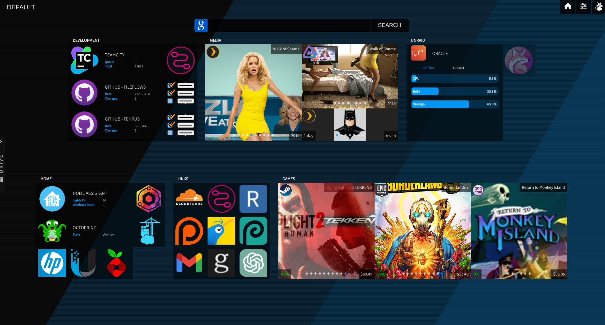

<!-- generated -->

# Fenrus

1-Click installation template for Fenrus on Easypanel

## Description

Fenrus is a sleek and modern dashboard application designed to provide a centralized hub for accessing your self-hosted services and applications. It offers a clean, customizable interface that allows you to organize your various web applications and resources in a single, easy-to-navigate dashboard. Fenrus supports both dark and light themes, custom backgrounds, and different layout options to match your preferences. It&#39;s perfect for home server enthusiasts who want a beautiful and functional starting point for their self-hosted ecosystem.

## Instructions

Access the dashboard at the configured port to start customizing your experience

## Benefits

- Centralized Dashboard: Fenrus provides a single, unified interface for accessing all your self-hosted applications and services, eliminating the need to remember multiple URLs.
- Customizable Interface: Personalize your dashboard with different themes, layouts, and backgrounds to create an experience that matches your preferences and workflow.
- Organized Access: Group your applications into categories and organize them in a way that makes the most sense for your specific needs and usage patterns.

## Features

- Multiple Themes: Choose between light and dark themes or customize the appearance to suit your visual preferences.
- Application Categories: Organize your applications into logical categories for easier navigation and improved workflow efficiency.
- Custom Backgrounds: Set custom background images or colors to personalize your dashboard experience.
- Responsive Design: Access your dashboard from any device with a fully responsive design that adapts to different screen sizes.
- Quick Access: Quickly access your most frequently used services with a clean, intuitive interface designed for efficiency.

## Links

- [Docker](https://hub.docker.com/r/revenz/fenrus)
- [GitHub](https://github.com/revenz/Fenrus)
- [Template Source](https://github.com/easypanel-io/templates/tree/main/templates/fenrus)

## Options

Name | Description | Required | Default Value
-|-|-|-
App Service Name | - | yes | fenrus
App Service Image | - | yes | revenz/fenrus:23.08
Timezone | - | no | Pacific/Auckland

## Screenshots

## Change Log

- 2025-04-17 – first release

## Contributors

- [Ahson Shaikh](https://github.com/Ahson-Shaikh)
