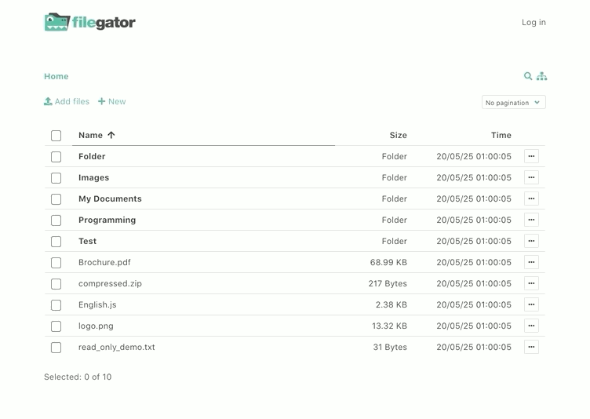

<!-- generated -->

# Filegator

1-Click installation template for Filegator on Easypanel

## Description

Filegator is a free, open-source, self-hosted web application for managing files and folders. It provides a user-friendly interface for organizing, uploading, downloading, and sharing files with comprehensive file management capabilities. Built with PHP, it offers multi-user support with different access permissions, roles, and home folders. All basic file operations are supported including copy, move, rename, edit, create, delete, preview, zip, unzip, download, and upload. The file upload feature supports drag &amp; drop, progress bar, pause and resume functionality with chunked uploads for large files. Perfect for teams, students, field workers, and anyone needing a simple yet powerful file sharing and management solution.

## Instructions

Login using credentials - admin/admin123

## Benefits

- User-Friendly File Management: Simple and intuitive interface that makes file management easy for users of all technical levels. No complex navigation or confusing menus.
- Multi-User Support: Support for multiple users with different access permissions, roles, and individual home folders for organized file sharing.
- Comprehensive File Operations: All essential file operations including copy, move, rename, edit, create, delete, preview, zip, unzip, download, and upload functionality.
- Advanced Upload Features: Drag & drop file uploads with progress bars, pause and resume capability, and chunked uploads for handling large files efficiently.
- Flexible Storage Options: Manage files in your local repository or connect to other storage adapters for extended storage capabilities.
- Perfect for Teams and Organizations: Ideal for sharing folders with colleagues, students uploading work, field workers submitting data, or as a cloud backup solution.

## Features

- File Browser: Clean and responsive file browser interface with folder navigation, file previews, and search capabilities.
- User Management: Administrative panel for managing users, permissions, and access controls with role-based security.
- Bulk Operations: Select multiple files and folders for batch operations like download, delete, move, or copy to save time.
- File Sharing: Easy file and folder sharing with download links and access control for secure collaboration.

## Links

- [Github](https://github.com/filegator/filegator)
- [Documentation](https://docs.filegator.io)
- [Website](https://filegator.io)
- [Template Source](https://github.com/easypanel-io/templates/tree/main/templates/filegator)

## Options

Name | Description | Required | Default Value
-|-|-|-
App Service Name | - | yes | filegator
App Service Image | - | yes | filegator/filegator:v7.13.0

## Screenshots

## Change Log

- 2025-08-04 – First release

## Contributors

- [Assistant](https://github.com)
