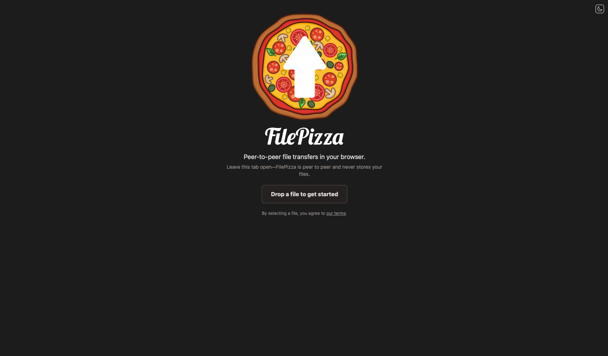

<!-- generated -->

# FilePizza

1-Click installation template for FilePizza on Easypanel

## Description

FilePizza is a peer-to-peer file sharing platform that enables secure, direct file transfers between users without storing files on servers. Using WebRTC technology, it creates direct connections between browsers for fast, private file sharing. The platform includes Redis for session management and COTURN server for NAT traversal, ensuring reliable connections across different network configurations. Perfect for sharing large files securely without upload limits or storage concerns.

## Benefits

- Direct Peer-to-Peer Transfer: Files are transferred directly between users using WebRTC technology, ensuring maximum privacy and speed without server-side storage.
- No File Size Limits: Transfer files of any size without worrying about upload limits or storage quotas imposed by traditional file sharing services.
- Enhanced Privacy & Security: Files never touch external servers during transfer, providing end-to-end encryption and complete data privacy.
- Real-time Transfer Status: Monitor transfer progress in real-time with detailed status updates and connection information for both sender and receiver.
- Cross-Platform Compatibility: Works seamlessly across all modern browsers and operating systems without requiring additional software installation.
- NAT Traversal Support: Built-in COTURN server ensures reliable connections even through firewalls and NAT configurations.

## Features

- WebRTC File Sharing: Utilizes WebRTC technology for direct browser-to-browser file transfers with automatic connection establishment.
- Redis Session Management: Persistent session storage using Redis for reliable connection tracking and metadata management.
- COTURN STUN/TURN Server: Integrated COTURN server provides STUN/TURN services for NAT traversal and firewall bypass capabilities.
- Real-time Progress Tracking: Live transfer progress indicators with speed metrics and estimated completion times for ongoing transfers.
- Multiple File Support: Support for transferring multiple files simultaneously with individual progress tracking for each file.
- Connection Status Monitoring: Real-time connection status with detailed network information and troubleshooting capabilities.
- Automatic Network Detection: External IP detection and relay IP configuration for optimal connection establishment across networks.
- Browser Compatibility: Compatible with all modern browsers supporting WebRTC, including Chrome, Firefox, Safari, and Edge.
- Responsive Web Interface: Clean, intuitive web interface that works perfectly on desktop and mobile devices for easy file sharing.
- Zero Server Storage: No files are stored on servers, ensuring complete privacy and eliminating storage costs and concerns.

## Links

- [Website](https://file.pizza)
- [GitHub](https://github.com/kern/filepizza)
- [Documentation](https://github.com/kern/filepizza#readme)
- [Template Source](https://github.com/easypanel-io/templates/tree/main/templates/filepizza)

## Options

Name | Description | Required | Default Value
-|-|-|-
App Service Name | - | yes | filepizza
App Service Image | - | yes | kern/filepizza:60704b4
COTURN Service Image | - | yes | coturn/coturn:4.7

## Screenshots

## Change Log

- 2025-07-23 – Initial release (8ea276d)
- 2025-12-25 – Version bumped to 60704b4

## Contributors

- [Ahson Shaikh](https://github.com/Ahson-Shaikh)
