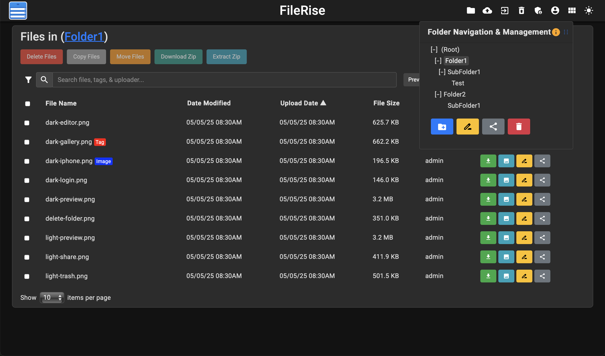

<!-- generated -->

# Filerise

1-Click installation template for Filerise on Easypanel

## Description

Filerise is a modern file sharing and management platform that allows you to upload, organize, and share files securely. It provides a clean web interface for file management with features like user authentication, file uploads, metadata management, and configurable upload limits.

## Instructions

On first launch, you will be guided to create the initial admin user.

## Benefits

- Modern File Management: Filerise provides a modern, intuitive interface for managing and sharing files with advanced features.
- User Authentication: Built-in user authentication system allows you to control access to your files and manage multiple users.
- Configurable Upload Limits: Set custom upload size limits to control storage usage and prevent abuse.
- Metadata Management: Advanced metadata tracking and management for better file organization and search capabilities.
- Self-Hosted Solution: Complete control over your file sharing platform with no external dependencies or data sharing.

## Features

- File Upload & Download: Easy file upload and download with progress tracking and error handling.
- User Management: Create and manage user accounts with different access levels and permissions.
- File Organization: Organize files in folders and categories with advanced search and filtering options.
- Metadata Tracking: Comprehensive metadata collection and management for all uploaded files.
- Security Features: Secure file sharing with configurable access controls and persistent token management.
- Web Interface: Clean, responsive web interface that works on desktop and mobile devices.
- Upload Size Control: Configurable upload size limits to manage storage and prevent system overload.

## Links

- [Website](https://filerise.net)
- [Documentation](https://filerise.net/docs/)
- [Github](https://github.com/error311/filerise)
- [Template Source](https://github.com/easypanel-io/templates/tree/main/templates/filerise)

## Options

Name | Description | Required | Default Value
-|-|-|-
App Service Name | - | yes | filerise
App Service Image | - | yes | error311/filerise-docker:v3.5.0
Total Upload Size | Maximum total upload size allowed | no | 10G

## Screenshots

## Change Log

- 2025-09-22 – First release

## Contributors

- [Ahson Shaikh](https://github.com/Ahson-Shaikh)
