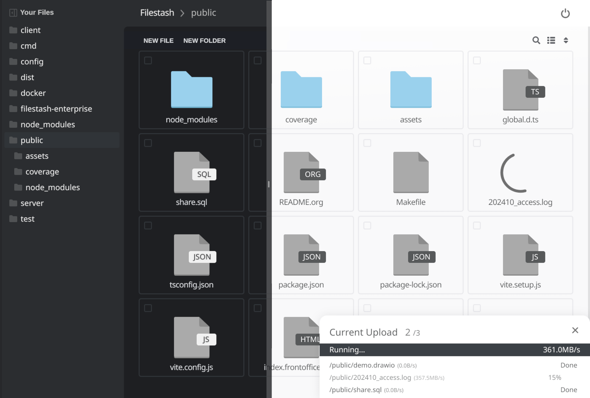

<!-- generated -->

# Filestash

1-Click installation template for Filestash on Easypanel

## Description

Filestash is a self-hosted file management and sharing platform designed for individuals and teams. It offers a secure, user-friendly interface to store, organize, and access all your files from one centralized location. With support for multiple file types, seamless integration with popular storage backends, tagging, and powerful search functionality, Filestash simplifies file management and boosts productivity. Whether working on personal projects or collaborating with your team, Filestash ensures your files are always accessible and easy to manage.

## Benefits

- Centralized File Management: Filestash provides a single, secure location to store all your files, making it easy to manage and access them whenever you need.
- Enhanced Productivity: With features like tagging, powerful search functionality, and integration with various storage providers, Filestash helps you quickly locate and reuse your files, improving your workflow.
- Collaboration and Sharing: Easily share files with teammates or external collaborators, enabling efficient teamwork and improving project outcomes.

## Features

- File Preview and Editing: View and edit your files directly in the browser without needing additional software.
- Storage Backend Support: Connect and manage files from a variety of storage backends, including FTP, SFTP, WebDAV, and cloud services.
- Secure Access: Implement user authentication and role-based access controls to keep your files private and secure.
- Powerful Search: Use advanced search features to quickly locate files by name, tags, or metadata.
- Integration Options: Integrate Filestash with other tools and services through its API and plugins, allowing seamless workflows.

## Links

- [Documentation](https://www.filestash.app/docs/)
- [Github](https://github.com/mickael-kerjean/filestash)
- [Template Source](https://github.com/easypanel-io/templates/tree/main/templates/filestash)

## Options

Name | Description | Required | Default Value
-|-|-|-
Service Name | - | yes | filestash
Service Image | - | yes | machines/filestash:latest

## Screenshots

## Change Log

- 2025-02-10 – First Release

## Contributors

- [Ahson Shaikh](https://github.com/Ahson-Shaikh)
