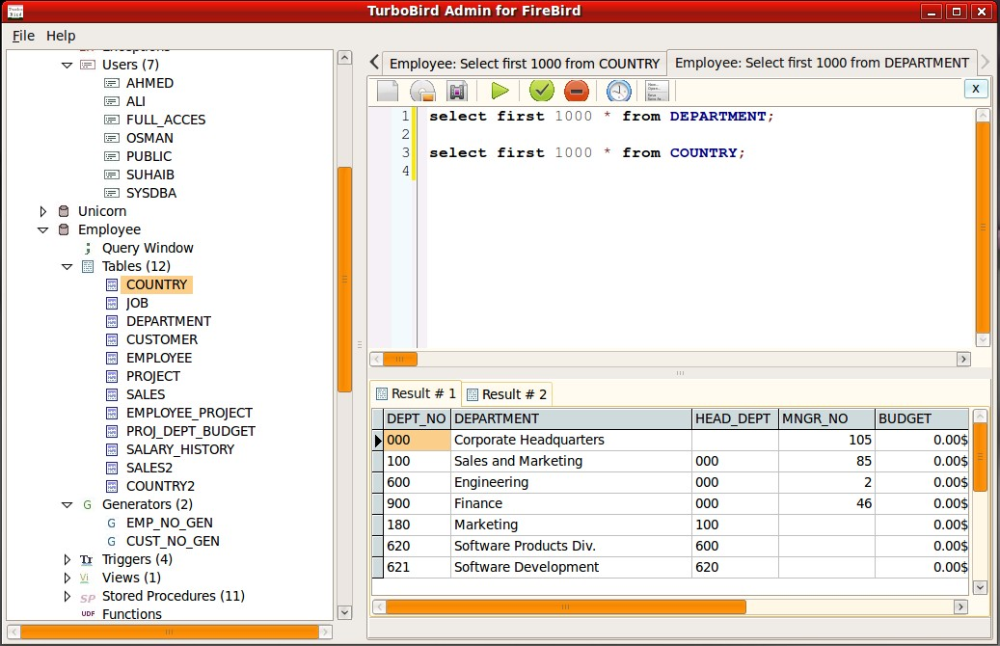

<!-- generated -->

# Firebird

1-Click installation template for Firebird on Easypanel

## Description

Firebird is a powerful, open-source relational database management system (RDBMS) that offers high performance, scalability, and SQL compliance. It is designed for both small and large-scale applications, providing robust multi-user support, stored procedures, triggers, and full ACID compliance. Firebird is lightweight, requiring minimal configuration while delivering strong reliability and security. It supports multiple authentication methods and integrates seamlessly with various programming languages and frameworks. With its containerized deployment, Firebird ensures easy scalability and simplified management.

## Benefits

- High Performance & Scalability: Firebird delivers exceptional speed and scalability, making it suitable for enterprise applications and large-scale databases.
- Open-Source & Cost-Effective: Firebird is completely open-source, offering a cost-effective RDBMS solution without licensing fees.
- ACID Compliance & Security: Ensures data integrity with full ACID compliance, robust authentication, and security mechanisms.

## Features

- SQL Standard Support: Firebird supports advanced SQL features, stored procedures, triggers, views, and more for complex database applications.
- Multi-Platform Compatibility: Firebird runs on multiple operating systems, including Windows, Linux, and macOS, ensuring cross-platform flexibility.
- Lightweight & Low Resource Usage: Requires minimal system resources while delivering high performance.
- Role-Based Access Control: Manage user roles and permissions for secure database access.
- Backup & Recovery Tools: Firebird provides built-in tools for database backup, restore, and disaster recovery.

## Links

- [Documentation](https://firebirdsql.org/manual/)
- [Github](https://github.com/FirebirdSQL/firebird)
- [Template Source](https://github.com/easypanel-io/templates/tree/main/templates/firebird)

## Options

Name | Description | Required | Default Value
-|-|-|-
App Service Name | - | yes | firebird
App Service Image | - | yes | firebirdsql/firebird:5.0.3
Root Password | - | yes | rootpassword
Database User | - | yes | dbuser
Database Password | - | yes | password

## Screenshots

## Change Log

- 2025-03-18 – Template Release
- 2025-07-21 – Version bumped to 5.0.3

## Contributors

- [Ahson Shaikh](https://github.com/Ahson-Shaikh)
