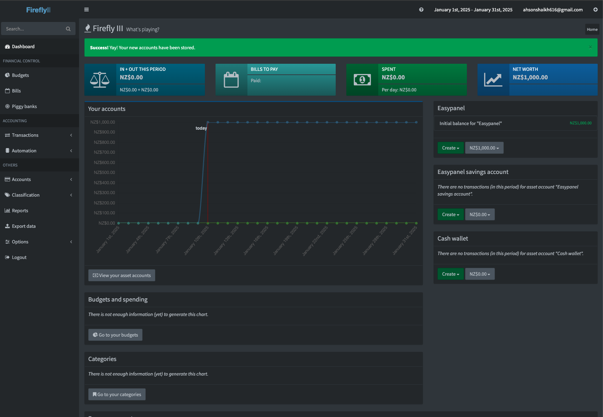

<!-- generated -->

# FireFlyIII

1-Click installation template for FireFlyIII on Easypanel

## Description

Firefly III is a self-hosted personal finance manager designed to help you take control of your finances. It provides a simple and intuitive interface for tracking expenses, creating budgets, and generating insightful reports. With its robust features, Firefly III enables you to analyze your financial data effectively.

## Benefits

- Comprehensive Financial Tracking: Firefly III allows you to track expenses, income, and transfers across multiple accounts with ease.
- Budgeting Made Simple: Plan your finances and track your spending habits with intuitive budgeting tools.
- Self-Hosted Privacy: Keep your financial data private and secure with a self-hosted solution.
- Insightful Reporting: Generate detailed financial reports to analyze and optimize your spending.

## Features

- Multi-Currency Support: Manage transactions in multiple currencies seamlessly.
- Budget and Savings Goals: Set and track budgets or savings goals to stay financially disciplined.
- Advanced Reporting: Gain insights with charts, reports, and visualizations of your financial data.
- API Access: Extend functionality or integrate Firefly III with other applications through its API.

## Links

- [Documentation](https://firefly-iii.org/documentation/)
- [Github](https://github.com/firefly-iii/firefly-iii)
- [Template Source](https://github.com/easypanel-io/templates/tree/main/templates/fireflyIII)

## Options

Name | Description | Required | Default Value
-|-|-|-
App Service Name | - | yes | fireflyiii
App Service Image | - | yes | fireflyiii/core:version-6.4.14

## Screenshots

## Change Log

- 2025-01-10 – Template Release
- 2025-07-21 – Version bumped to 6.2.21
- 2025-12-25 – Version bumped to 6.4.14

## Contributors

- [Ahson Shaikh](https://github.com/Ahson-Shaikh)
