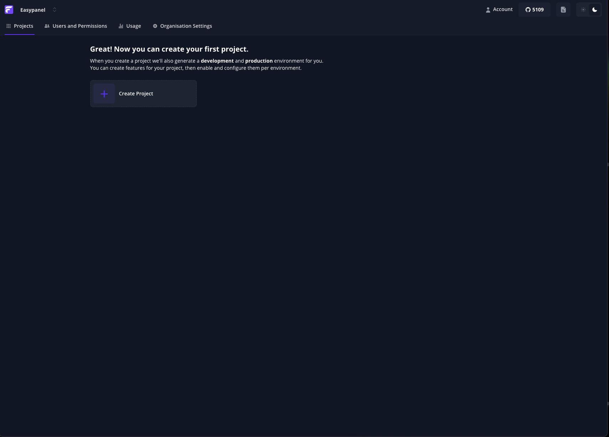

<!-- generated -->

# Flagsmith

1-Click installation template for Flagsmith on Easypanel

## Description

Flagsmith is a powerful, self-hosted service for feature flag management, remote configuration, and experimentation. It provides a clean and simple interface, supports integrations with various tools, and offers advanced analytics for feature usage and experimentation results. With Flagsmith, you can maintain control over your feature management and deployment process.

## Benefits

- Centralized Feature Management: Manage feature flags across all your environments and applications from a single platform.
- Remote Configuration: Dynamically control application behavior without redeploying your code.
- Self-Hosted Solution: Stay in control of your data and feature management with a self-hosted service.

## Features

- REST API: Integrate Flagsmith with other tools using its flexible API for programmatic access.
- Integrations: Connect Flagsmith with tools like Slack, Segment, or GitHub for streamlined workflows.
- Advanced Analytics: Gain insights into feature usage, experiments, and configurations for better decision-making.
- Multi-Environment Support: Manage and deploy feature flags across multiple environments with ease.

## Links

- [Documentation](https://docs.flagsmith.com/)
- [GitHub](https://github.com/Flagsmith/flagsmith)
- [Template Source](https://github.com/easypanel-io/templates/tree/main/templates/flagsmith)

## Options

Name | Description | Required | Default Value
-|-|-|-
App Service Name | - | yes | flagsmith
App Service Image | - | yes | flagsmith.docker.scarf.sh/flagsmith/flagsmith:latest

## Screenshots

## Change Log

- 2025-01-01 – Template Release

## Contributors

- [Ahson Shaikh](https://github.com/Ahson-Shaikh)
