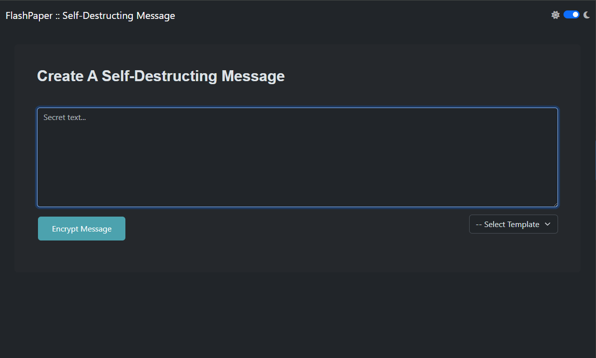

<!-- generated -->

# FlashPaper

1-Click installation template for FlashPaper on Easypanel

## Description

FlashPaper is a secure, self-destructing message service that allows you to share sensitive information safely. Messages are encrypted and automatically destroyed after being viewed once, ensuring that sensitive data remains secure and temporary.

## Instructions

After installation, access the web interface through the provided domain to start creating self-destructing messages.

## Benefits

- Self-Destructing Messages: Messages are automatically destroyed after being viewed once.
- Secure Communication: Share sensitive information securely with automatic destruction.
- Customizable Interface: Customize the interface with your own branding and messages.
- Message Pruning: Automatic cleanup of old messages for better security.
- Easy Sharing: Simple URL-based sharing of encrypted messages.

## Features

- One-Time Viewing: Messages can only be viewed once before being destroyed.
- Custom Branding: Customize the interface with your logo and text.
- Message Management: Automatic pruning of old messages.
- Secure Storage: Encrypted storage of messages until viewed.
- Simple Interface: Easy-to-use web interface for creating and viewing messages.

## Links

- [Github](https://github.com/AndrewPaglusch/FlashPaper)
- [Website](https://flashpaper.io)
- [Template Source](https://github.com/easypanel-io/templates/tree/main/templates/flashpaper)

## Options

Name | Description | Required | Default Value
-|-|-|-
App Service Name | - | yes | flashpaper
App Service Image | - | yes | ghcr.io/andrewpaglusch/flashpaper:2.4.0

## Screenshots

## Change Log

- 2025-04-10 – First Release

## Contributors

- [Ahson Shaikh](https://github.com/Ahson-Shaikh)
