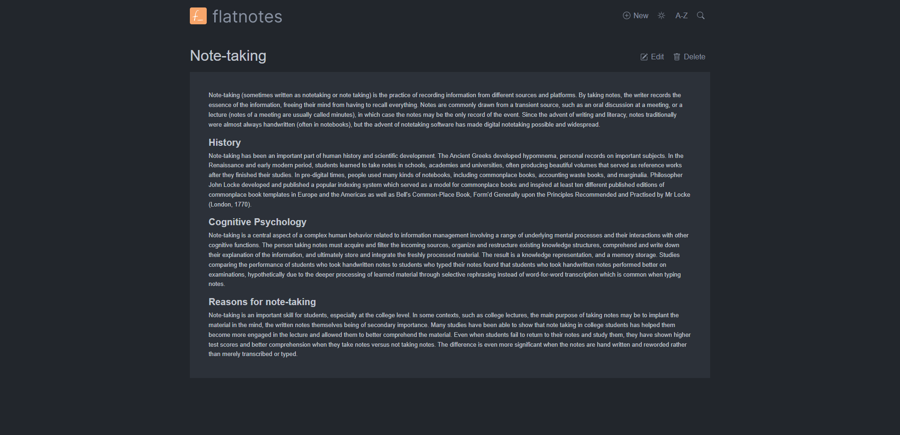

<!-- generated -->

# Flatnotes

1-Click installation template for Flatnotes on Easypanel

## Description

Flatnotes is an open-source, self-hosted note-taking platform designed to help individuals and teams manage their notes efficiently. It provides a lightweight and intuitive interface for creating, organizing, and sharing notes. With robust customization options, Flatnotes supports markdown editing, tagging, and a responsive design, making it a versatile solution for note management.

## Benefits

- Lightweight and Fast: Flatnotes provides a minimalistic platform that is quick to set up and use for note-taking.
- Customizable and Flexible: Flatnotes allows users to personalize their note-taking experience with markdown support and tagging.
- Accessible Anywhere: A responsive design ensures that notes are accessible on desktops, tablets, and mobile devices.

## Features

- Markdown Support: Write and edit notes using markdown for a rich text editing experience.
- Note Tagging: Organize notes effectively with a robust tagging system.
- Search and Filter: Quickly find notes using the search and filtering functionality.
- Self-Hosted for Privacy: Host Flatnotes on your own server to ensure complete control over your data.
- Responsive Interface: Access and manage notes seamlessly across all devices.

## Links

- [Github](https://github.com/dullage/flatnotes)
- [Demo](https://flatnotes.dullage.com/)
- [Template Source](https://github.com/easypanel-io/templates/tree/main/templates/flatnotes)

## Options

Name | Description | Required | Default Value
-|-|-|-
App Service Name | - | yes | flatnotes
App Service Image | - | yes | dullage/flatnotes:v5.4.0
Username | - | yes | flatnotesuser
Password | - | yes | password

## Screenshots

## Change Log

- 2025-01-20 – First Release

## Contributors

- [Ahson Shaikh](https://github.com/Ahson-Shaikh)
