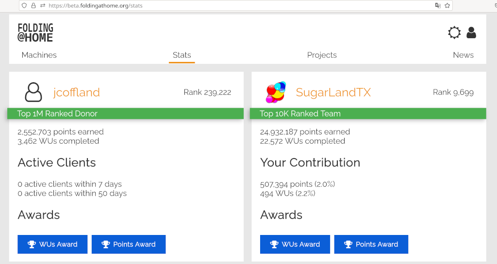

<!-- generated -->

# Folding@Home

1-Click installation template for Folding@Home on Easypanel

## Description

Folding@Home is a distributed computing project that simulates protein folding and other molecular dynamics to help researchers understand how proteins work and how they can malfunction. By donating your unused computing power, you become a citizen scientist contributing to research on diseases like COVID-19, Alzheimer&#39;s, cancer, and many others. The project uses your computer to run simulations that help scientists develop new treatments and understand biological processes.

## Benefits

- Contribute to Science: Help researchers understand diseases and develop new treatments by donating your computer's idle processing power to important research.
- Fight Global Diseases: Contribute to research on COVID-19, Alzheimer's disease, cancer, Parkinson's, and many other conditions affecting millions worldwide.
- Easy Participation: Simply deploy and let it run - the software automatically downloads and processes research tasks while your computer is idle.

## Features

- Distributed Computing: Part of a global network of volunteers contributing computing power to scientific research and drug discovery efforts.
- Web Interface: Monitor your contributions, view statistics, and configure settings through an intuitive web-based control panel.
- Automatic Task Management: Automatically downloads work units, processes them, and uploads results without requiring manual intervention.
- Team Collaboration: Join teams to collaborate with others and track collective contributions to research projects.

## Links

- [Website](https://foldingathome.org/)
- [Documentation](https://foldingathome.org/start-folding/)
- [Template Source](https://github.com/easypanel-io/templates/tree/main/templates/foldingathome)

## Options

Name | Description | Required | Default Value
-|-|-|-
App Service Name | - | yes | foldingathome
App Service Image | - | yes | lscr.io/linuxserver/foldingathome:8.5.5

## Screenshots

## Change Log

- 2025-07-01 – Initial release
- 2026-04-29 – Version bumped to 8.5.5

## Contributors

- [Ahson Shaikh](https://github.com/Ahson-Shaikh)
