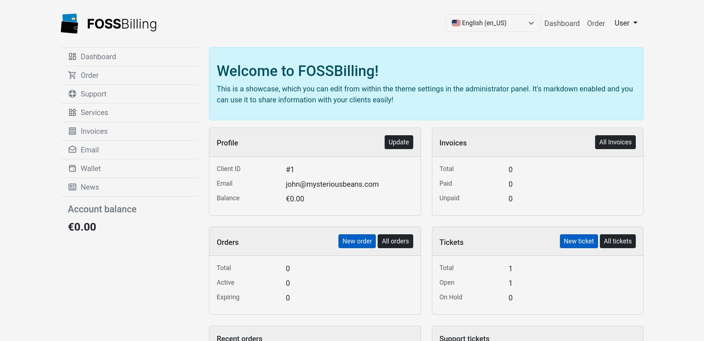

<!-- generated -->

# FOSSBilling

1-Click installation template for FOSSBilling on Easypanel

## Description

FOSSBilling is a free, open-source billing and client management system designed for hosting providers, service providers, and freelancers. It provides comprehensive tools for managing clients, products, services, invoices, and payments. FOSSBilling features automated billing cycles, support ticket management, domain registration integration, customizable invoice templates, and multi-currency support. The platform includes a client portal where customers can manage their services, view invoices, and submit support tickets. With support for multiple payment gateways including PayPal, Stripe, and others, FOSSBilling streamlines the entire billing workflow. Perfect for web hosting companies, SaaS providers, and service-based businesses who need professional billing automation without expensive licensing fees.

## Instructions

After deployment, open your domain and run the FOSSBilling web installer.
Use MySQL connection details, keep /var/www/html on persistent storage as configured.

## Benefits

- Complete Billing Automation: Automate recurring billing, invoice generation, payment processing, and service provisioning with customizable billing cycles.
- Client Self-Service Portal: Professional client portal allows customers to manage services, pay invoices, submit tickets, and access account information 24/7.
- Open Source & Cost-Free: Fully open-source with no licensing fees or per-client charges. Complete control over your billing system with community support.

## Features

- Invoice Management: Generate professional invoices automatically with customizable templates, multiple currencies, and tax configuration.
- Product & Service Management: Create and manage products, services, and pricing plans with flexible configuration and automated provisioning.
- Payment Gateway Integration: Accept payments through multiple gateways including PayPal, Stripe, and other popular payment processors.
- Support Ticket System: Built-in helpdesk with ticket management, email piping, canned responses, and customer communication tracking.
- Client Portal: Self-service portal where clients can manage services, view invoices, make payments, and submit support requests.
- Domain Registration: Integrate with domain registrars for automated domain registration, renewal, and management within the platform.

## Links

- [Website](https://fossbilling.org/)
- [Documentation](https://fossbilling.org/docs)
- [Github](https://github.com/FOSSBilling/FOSSBilling)
- [Template Source](https://github.com/easypanel-io/templates/tree/main/templates/fossbilling)

## Options

Name | Description | Required | Default Value
-|-|-|-
App Service Name | - | yes | fossbilling
App Service Image | - | yes | fossbilling/fossbilling:0.7.2

## Screenshots

## Change Log

- 2025-11-21 – Template Release
- 2026-03-24 – Fixed instructions and added screenshot.

## Contributors

- [Ahson Shaikh](https://github.com/Ahson-Shaikh)
