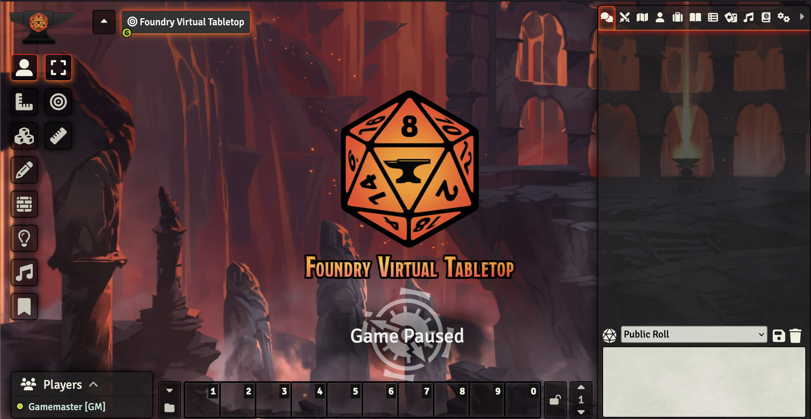

<!-- generated -->

# FoundryVTT

1-Click installation template for FoundryVTT on Easypanel

## Description

Foundry Virtual Tabletop is a modern, self-hosted virtual tabletop platform designed for playing tabletop roleplaying games online. It provides a comprehensive suite of tools for game masters and players, including dynamic lighting, fog of war, automated combat systems, and extensive customization options. FoundryVTT supports multiple game systems and offers a rich ecosystem of community-created modules and content. With its powerful JavaScript API and intuitive interface, FoundryVTT delivers an immersive gaming experience that rivals traditional tabletop gaming.

## Instructions

FoundryVTT is proprietary software, so there is no official public `foundryvtt/foundryvtt` Docker image on Docker Hub. This template uses `felddy/foundryvtt`, which is the widely used community container maintained specifically for licensed FoundryVTT deployments. You must provide a valid FoundryVTT release URL and your foundryvtt.com account credentials so the container can download your licensed build. Keep these credentials private. On first startup, complete setup in the web UI, set an admin key, and activate your FoundryVTT license. All persistent data is stored in `/data`.

## Benefits

- Self-Hosted Control: Maintain complete control over your virtual tabletop server with self-hosted deployment, ensuring your game data stays private and secure.
- Rich Feature Set: Access powerful features including dynamic lighting, fog of war, automated combat, and extensive customization options for immersive gaming experiences.
- Extensive Module Ecosystem: Benefit from a thriving community of developers creating modules and content to enhance your gaming sessions with additional functionality.
- Multi-System Support: Play virtually any tabletop RPG system with official and community-created game systems, from D&D to custom homebrew systems.

## Features

- Dynamic Lighting System: Advanced lighting and vision system that creates realistic shadows and line-of-sight mechanics for enhanced immersion during gameplay.
- Automated Combat: Streamlined combat system with automated dice rolling, damage calculation, and turn management to keep games flowing smoothly.
- Rich Media Support: Upload and manage maps, tokens, audio, and video content to create immersive gaming environments with high-quality assets.
- Real-Time Collaboration: Multiple players can interact simultaneously with live updates, chat, and collaborative tools for seamless online gaming sessions.
- JavaScript API: Powerful scripting capabilities allow for custom automation, macros, and module development to tailor the experience to your specific needs.
- Cross-Platform Compatibility: Works on Windows, Mac, Linux, and mobile devices, ensuring all players can join your games regardless of their preferred platform.

## Links

- [Website](https://foundryvtt.com/)
- [Documentation](https://foundryvtt.com/kb/)
- [GitHub (container source)](https://github.com/felddy/foundryvtt-docker)
- [Docker Hub (container image)](https://hub.docker.com/r/felddy/foundryvtt)
- [Community](https://discord.gg/foundryvtt)
- [Template Source](https://github.com/easypanel-io/templates/tree/main/templates/foundryvtt)

## Options

Name | Description | Required | Default Value
-|-|-|-
App Service Name | - | yes | foundryvtt
App Service Image | - | yes | felddy/foundryvtt:sha-18b36bf
FoundryVTT Release URL | The URL of the FoundryVTT release | yes | 
FoundryVTT Username | Your FoundryVTT.com account username | yes | 
FoundryVTT Password | Your FoundryVTT.com account password | yes | 
Admin Key | Initial admin key for first-time setup | no | 
License Key | Your FoundryVTT license key (required for activation) | no | 

## Screenshots

## Change Log

- 2026-03-26 – Added container source links and documented why community image is used
- 2025-10-09 – Initial template release (SHA-18b36bf)

## Contributors

- [Ahson Shaikh](https://github.com/Ahson-Shaikh)
