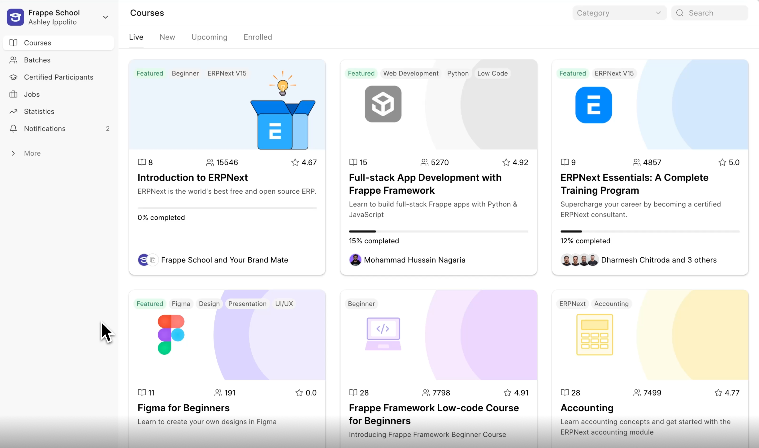

<!-- generated -->

# Frappe LMS

1-Click installation template for Frappe LMS on Easypanel

## Description

LMS (Learning Management System) is a comprehensive educational platform built on the Frappe framework that enables organizations to create, manage, and deliver online learning content. The system provides course management, student enrollment, progress tracking, assessments, and interactive learning features. Built with modern web technologies, it offers a robust and scalable solution for educational institutions, corporate training programs, and online learning platforms. The Frappe-based architecture ensures reliability, extensibility, and ease of customization for specific learning requirements.

## Instructions

Default login credentials are Administrator/admin. It takes 5-7 minutes to install the app.

## Benefits

- Comprehensive Learning Management: Complete learning management system with course creation, student enrollment, progress tracking, and assessment capabilities for comprehensive educational delivery.
- Modern Web Framework: Built on the Frappe framework, providing a modern, scalable, and extensible architecture for reliable learning management operations.
- Interactive Learning Features: Rich interactive features including multimedia content support, discussion forums, assignments, and real-time progress monitoring for engaging learning experiences.
- Multi-tenant Architecture: Support for multiple organizations, courses, and user roles with secure isolation and customizable learning environments.
- Assessment and Analytics: Built-in assessment tools, grading systems, and comprehensive analytics for tracking student performance and learning outcomes.
- Mobile Responsive Design: Responsive design that works seamlessly across desktop, tablet, and mobile devices for accessible learning anywhere, anytime.

## Features

- Course Management: Create and manage courses with structured content, modules, lessons, and multimedia resources for comprehensive learning delivery.
- Student Enrollment: Streamlined student enrollment process with user management, role-based access control, and automated course assignments.
- Progress Tracking: Real-time progress monitoring with detailed analytics, completion tracking, and performance metrics for both students and instructors.
- Assessment Tools: Built-in assessment creation tools with multiple question types, automated grading, and detailed feedback mechanisms.
- Discussion Forums: Interactive discussion forums for student collaboration, Q&A sessions, and community-based learning experiences.
- Content Management: Rich content management system supporting various media types, file uploads, and structured content organization.

## Links

- [Github](https://github.com/frappe/lms)
- [Documentation](https://frappe.io/learning)
- [Website](https://frappeframework.com)
- [Template Source](https://github.com/easypanel-io/templates/tree/main/templates/frappe-lms)

## Options

Name | Description | Required | Default Value
-|-|-|-
App Service Name | - | yes | frappe-lms
App Service Image | - | yes | frappe/bench:v5.28.0

## Screenshots

## Change Log

- 2025-08-06 – First release
- 2025-12-25 – Version bumped to v5.28.0

## Contributors

- [Ahson Shaikh](https://github.com/Ahson-Shaikh)
