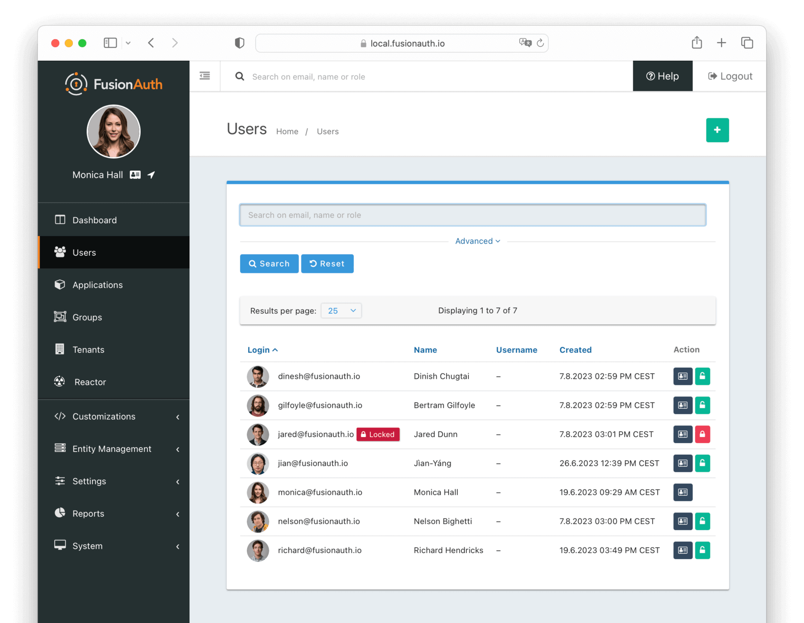

<!-- generated -->

# FusionAuth

1-Click installation template for FusionAuth on Easypanel

## Description

FusionAuth is a powerful, self-hosted identity and access management platform designed for developers. It provides a robust set of features, including user authentication, authorization, and user management, all accessible through a modern API or web interface. FusionAuth supports advanced features like social login, SSO, passwordless login, and multi-factor authentication.

## Benefits

- Comprehensive Identity Management: FusionAuth allows you to manage user authentication, authorization, and profiles efficiently through a user-friendly interface or APIs.
- Developer-Centric Solution: Designed with developers in mind, FusionAuth is easy to integrate into any application stack with extensive documentation and SDKs.
- Secure and Flexible: FusionAuth provides advanced security features such as SSO, passwordless login, and multi-factor authentication for ultimate flexibility.

## Features

- Multi-Factor Authentication: Enhance user security with support for TOTP, SMS, and email-based multi-factor authentication.
- Social Login: Easily integrate with popular social providers like Google, Facebook, and Twitter for quick user onboarding.
- Customizable Branding: Fully customize the look and feel of your login pages and user portals to match your brand.
- Role-Based Access Control: Manage user permissions and access with fine-grained role-based access control.

## Links

- [Documentation](https://fusionauth.io/docs)
- [Github](https://github.com/FusionAuth)
- [Template Source](https://github.com/easypanel-io/templates/tree/main/templates/fusionauth)

## Options

Name | Description | Required | Default Value
-|-|-|-
App Service Name | - | yes | fusionauth
App Service Image | - | yes | fusionauth/fusionauth-app:1.55.1
OpenSearch Service Image | - | yes | opensearchproject/opensearch:2.11.0

## Screenshots

## Change Log

- 2025-01-17 – Template Release

## Contributors

- [Ahson Shaikh](https://github.com/Ahson-Shaikh)
