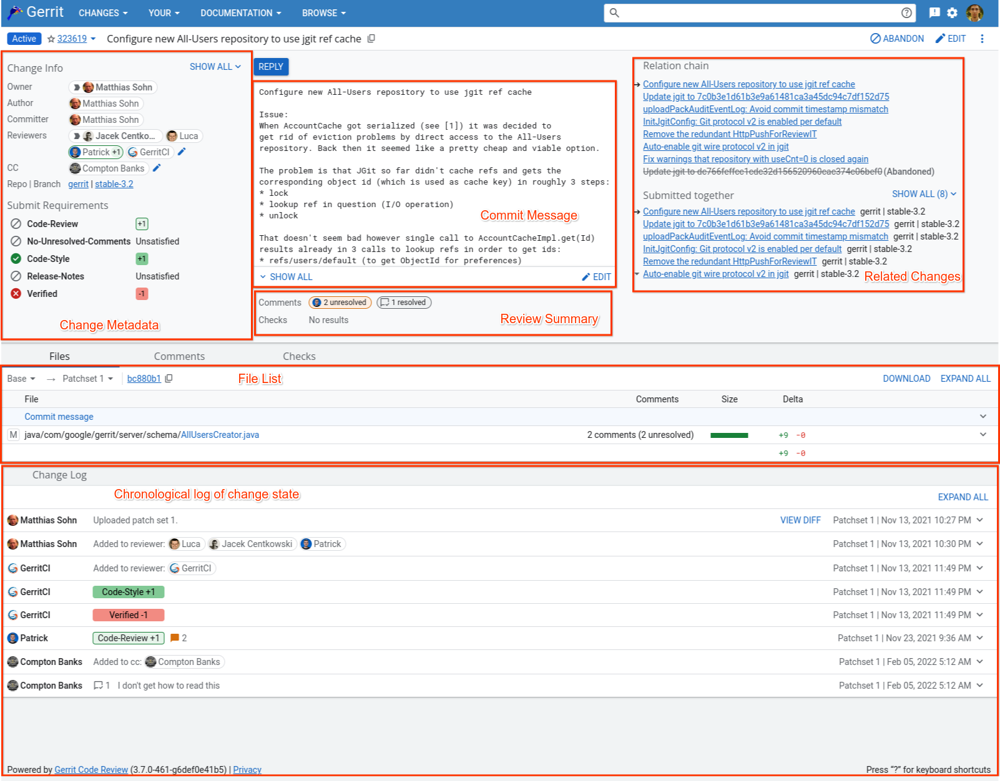

<!-- generated -->

# Gerrit

1-Click installation template for Gerrit on Easypanel

## Description

Gerrit is a web-based code review tool that integrates with Git. It provides a framework for reviewing code changes before they are merged into the codebase, making it an essential tool for collaborative software development.

## Benefits

- Code Review: Streamlined code review process with inline comments.
- Git Integration: Seamless integration with Git repositories.
- Access Control: Fine-grained access control for projects and branches.
- Collaboration: Enhanced team collaboration through code review.

## Features

- Web Interface: User-friendly web interface for code review.
- SSH Access: Secure SSH access for Git operations.
- Project Management: Built-in project and repository management.
- Plugin System: Extensible through a rich plugin ecosystem.

## Links

- [Website](https://www.gerritcodereview.com/)
- [Documentation](https://gerrit-documentation.storage.googleapis.com/Documentation/3.7.1/index.html)
- [GitHub](https://github.com/GerritCodeReview/gerrit)
- [Template Source](https://github.com/easypanel-io/templates/tree/main/templates/gerrit)

## Options

Name | Description | Required | Default Value
-|-|-|-
App Service Name | - | yes | gerrit
Gerrit Image | - | yes | gerritcodereview/gerrit:3.13.1

## Screenshots

## Change Log

- 2025-04-03 – Initial template release
- 2025-07-21 – Version bumped to 3.12.1
- 2025-12-25 – Version bumped to 3.13.1

## Contributors

- [Ahson Shaikh](https://github.com/Ahson-Shaikh)
