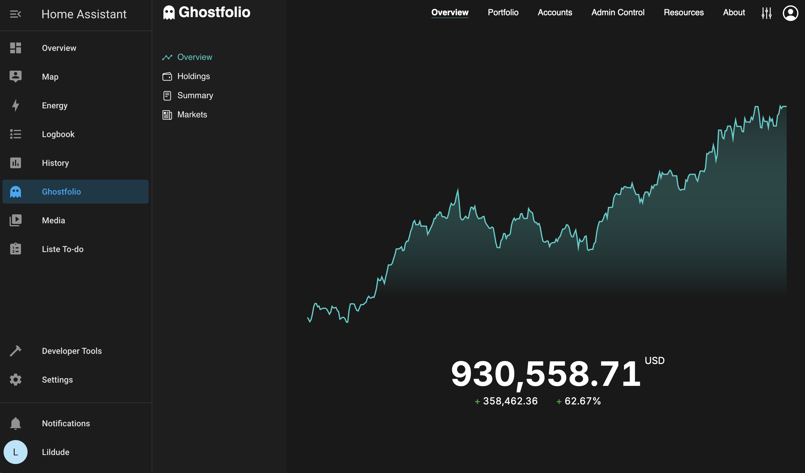

<!-- generated -->

# Ghostfolio

1-Click installation template for Ghostfolio on Easypanel

## Description

Ghostfolio is a self-hosted wealth management application that allows users to track and analyze their investment portfolios. It provides insights into asset allocation, risk exposure, and financial growth, helping individuals make informed decisions about their finances. With Ghostfolio, users can connect their brokerage accounts, monitor their investments in real-time, and gain a comprehensive overview of their financial health. The application is accessible via a web interface and offers API support for integrations. Built for privacy and control, Ghostfolio is an excellent solution for self-hosted personal finance management.

## Instructions

Click on get started, create account and save the generated token safely for logins.

## Benefits

- Personal Finance Management: Ghostfolio provides users with a self-hosted solution to track and manage their investment portfolios, ensuring complete privacy and control.
- Real-Time Portfolio Insights: Users can monitor asset performance, view real-time price updates, and analyze their financial growth with powerful visualization tools.
- Secure and Private: Ghostfolio is designed for self-hosting, meaning all financial data remains private and under user control, without reliance on third-party services.

## Features

- Multi-Asset Support: Track stocks, ETFs, cryptocurrencies, and other financial assets in a single dashboard.
- API Access: Integrate Ghostfolio with other applications using its API for automated data retrieval.
- Risk Analysis: Assess portfolio risk exposure with advanced analytics and performance indicators.
- Transaction Tracking: Log and monitor investment transactions to maintain an accurate financial history.

## Links

- [Documentation](https://ghostfolio.dev/docs/)
- [Github](https://github.com/ghostfolio/ghostfolio)
- [Template Source](https://github.com/easypanel-io/templates/tree/main/templates/ghostfolio)

## Options

Name | Description | Required | Default Value
-|-|-|-
App Service Name | - | yes | ghostfolio
App Service Image | - | yes | docker.io/ghostfolio/ghostfolio:2.137.1

## Screenshots

## Change Log

- 2025-02-06 – Template Release

## Contributors

- [Ahson Shaikh](https://github.com/Ahson-Shaikh)
