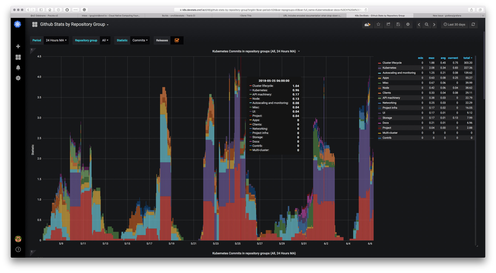

<!-- generated -->

# GHStats

1-Click installation template for GHStats on Easypanel

## Description

GHStats is a self-hosted GitHub statistics and analytics tool that helps you track and visualize your GitHub repository metrics. Monitor stars, traffic, clones, views, and other important repository statistics over time with an intuitive web interface. The application collects and stores historical data from your GitHub repositories, allowing you to analyze trends and growth patterns that would otherwise be lost after GitHub&#39;s 14-day statistics retention period. Perfect for developers, project maintainers, and organizations who want to maintain long-term analytics of their GitHub presence. GHStats requires a GitHub personal access token to fetch repository statistics and stores all collected data persistently for historical analysis and visualization.

## Instructions

Create a GitHub personal access token before deploying. Open https://github.com/settings/tokens and generate a classic token with at least the public_repo scope so GHStats can collect repository traffic data. If you want private repositories included, use repo scope and set GHS_INCLUDE_PRIVATE=true in a custom environment override. Paste the token into the GitHub Token field in this template. The app reads it as GITHUB_TOKEN and starts collecting metrics into /app/data. After deployment, open the assigned domain on port 8080. The first sync may take a little time depending on repository count, then dashboard history updates on the hourly scheduler.

## Benefits

- Historical Data Retention: Keep long-term history of your GitHub repository statistics beyond GitHub's default 14-day retention period for comprehensive analytics.
- Self-Hosted Analytics: Host your own GitHub statistics dashboard with complete control over your data and privacy without relying on third-party services.
- Repository Insights: Track stars, traffic, clones, views, and other metrics to understand your repository's growth and popularity trends over time.
- Data Persistence: All collected statistics are stored persistently in a dedicated volume, ensuring your historical data is never lost.

## Features

- GitHub Statistics Tracking: Automatically collects and stores repository statistics including stars, forks, traffic, clones, and views from your GitHub repositories.
- Historical Data Storage: Maintains long-term historical records of all collected metrics, allowing you to analyze trends beyond GitHub's limited retention period.
- Web Dashboard: Access your GitHub statistics through a clean web interface with visualizations and insights accessible from any device.
- Multiple Repositories: Track statistics across multiple GitHub repositories from a single dashboard for comprehensive project portfolio monitoring.
- Persistent Storage: All collected data is stored in a persistent volume mounted at /app/data, ensuring your statistics history survives container restarts.
- Automated Collection: Automatically fetches and updates repository statistics at regular intervals without manual intervention required.
- Lightweight Deployment: Runs efficiently with minimal resource requirements, perfect for any Docker-capable host or cloud environment.
- GitHub API Integration: Uses official GitHub API with your personal access token to securely fetch repository data and statistics.

## Links

- [Documentation](https://github.com/vladkens/ghstats/blob/main/readme.md)
- [GitHub](https://github.com/vladkens/ghstats)
- [Template Source](https://github.com/easypanel-io/templates/tree/main/templates/ghstats)

## Options

Name | Description | Required | Default Value
-|-|-|-
App Service Name | - | yes | ghstats
App Service Image | GHStats Docker image | yes | ghcr.io/vladkens/ghstats:v0.8.0
GitHub Token | GitHub personal access token for fetching repository statistics | yes | 

## Screenshots

## Change Log

- 2025-10-30 – Initial Template Release
- 2026-03-25 – Added setup instructions for required githubToken and token scopes
- 2026-04-29 – Version bumped to v0.8.0

## Contributors

- [Ahson Shaikh](https://github.com/Ahson-Shaikh)
