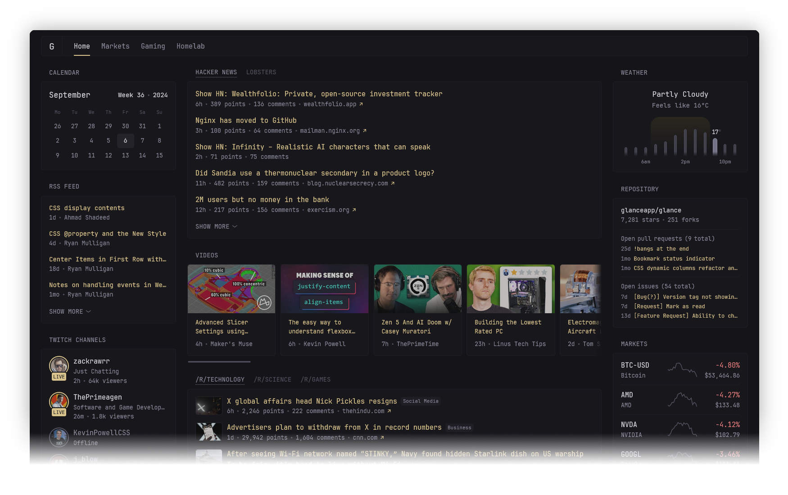

<!-- generated -->

# Glance

1-Click installation template for Glance on Easypanel

## Description

Glance is a fast and lightweight self-hosted dashboard that allows you to monitor various real-time data sources through customizable widgets. With support for RSS feeds, market prices, YouTube uploads, Twitch streams, weather forecasts, server stats, Docker container status, and more, Glance provides a centralized hub for tracking essential information. The dashboard is fully themeable, optimized for mobile devices, and highly configurable through YAML-based settings.

## Instructions

You can edit the Yaml configuration as per your needs.

## Benefits

- Fully Customizable Dashboard: Glance allows users to create their own dashboard layouts with multiple pages, tabs, and widgets, tailored to their specific needs.
- Supports Multiple Data Sources: Monitor RSS feeds, weather forecasts, financial market prices, Docker container status, server metrics, social media updates, and more.
- Fast and Lightweight: Glance is designed for low memory usage with minimal dependencies, ensuring fast performance even with multiple widgets.
- Optimized for Mobile Devices: The dashboard is mobile-friendly, allowing users to track their favorite widgets on the go.
- Highly Themeable: Users can customize themes, styles, and layouts to match their preferences or choose from pre-existing themes.

## Features

- Various Widgets: Supports RSS feeds, subreddit posts, Hacker News updates, YouTube channel uploads, Twitch streams, weather forecasts, market prices, Docker container statuses, server stats, and more.
- YAML-Based Configuration: Easily configure widgets, pages, and layouts using a simple YAML-based setup.
- Multi-Page Support: Users can create multiple pages/tabs with different sets of widgets for better organization.
- Minimal and Efficient: Glance is designed to be fast and efficient, with an uncached page loading time of ~1s depending on network speed and number of widgets.
- Theme and Style Customization: Modify CSS styles, change widget designs, and adjust layout settings to match user preferences.

## Links

- [Documentation](https://github.com/glanceapp/glance/blob/main/docs/configuration.md)
- [Github](https://github.com/glanceapp/glance)
- [Template Source](https://github.com/easypanel-io/templates/tree/main/templates/glance)

## Options

Name | Description | Required | Default Value
-|-|-|-
App Service Name | - | yes | glance
App Service Image | - | yes | glanceapp/glance:v0.7.7

## Screenshots

## Change Log

- 2025-03-17 – First Release (v0.7.7)

## Contributors

- [Ahson Shaikh](https://github.com/Ahson-Shaikh)
