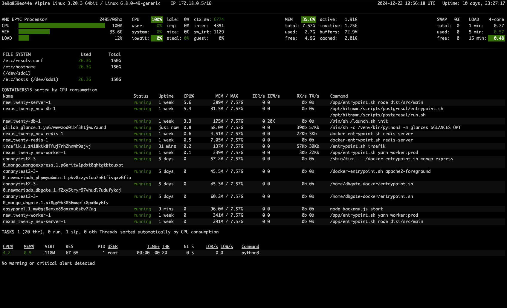
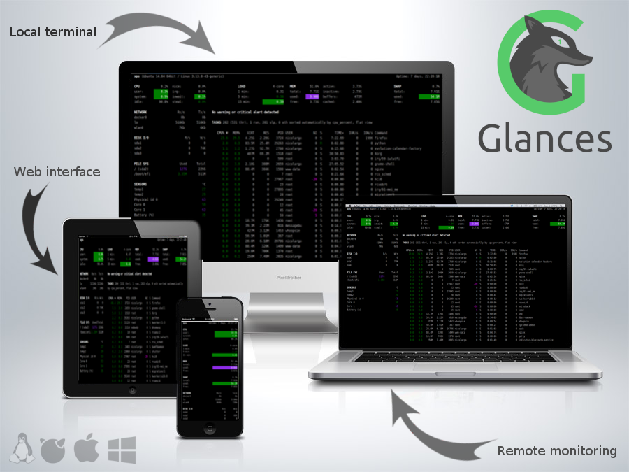

<!-- generated -->

# Glances

1-Click installation template for Glances on Easypanel

## Description

Glances is a cross-platform, real-time system monitoring tool designed to offer a unified view of your system&#39;s performance and health. It provides an intuitive interface that displays critical information, including CPU usage, memory, disk I/O, network activity, and more. Built to work seamlessly on Linux, macOS, Windows, and ARM-based systems, Glances is highly extensible with plugins and supports remote monitoring via a web-based UI or API. With its open-source foundation, Glances ensures transparency and flexibility, making it a perfect choice for individuals and teams looking for a lightweight yet powerful monitoring solution.

## Instructions

To use Glances with Podman, you can mount a bind volume &quot;/run/user/1000/podman/podman.sock:/run/user/1000/podman/podman.sock&quot;.

## Benefits

- Real-Time System Monitoring: Glances provides a detailed and real-time overview of system performance metrics, ensuring you stay informed about your system's health.
- Cross-Platform Support: Glances works seamlessly on Linux, macOS, Windows, and ARM-based systems, offering flexibility for diverse environments.
- Extensible and Customizable: With plugins and configuration options, Glances can be tailored to suit your specific monitoring needs.
- Remote Monitoring: Monitor systems remotely using the web interface, API, or third-party integrations.
- Open Source and Transparent: Glances is open source, ensuring users can audit, modify, and extend the tool as needed.

## Features

- Unified Monitoring Dashboard: Displays key performance metrics, including CPU, memory, disk usage, network traffic, and more, in a single view.
- Remote Access: Access Glances remotely using its web-based UI or RESTful API.
- Threshold-Based Alerts: Configure alerts based on thresholds to get notified about critical system issues in real-time.
- Plugin Support: Extend functionality with plugins for additional metrics or integrations with other tools.
- Multi-Platform Integration: Integrates with tools like Docker, Podman, and Kubernetes for container monitoring.

## Links

- [Website](https://nicolargo.github.io/glances/)
- [Documentation](https://glances.readthedocs.io/en/stable/)
- [GitHub](https://github.com/nicolargo/glances)
- [Template Source](https://github.com/easypanel-io/templates/tree/main/templates/glances)

## Options

Name | Description | Required | Default Value
-|-|-|-
App Service Name | - | yes | glances
App Service Image | - | yes | nicolargo/glances:latest-full

## Screenshots

## Change Log

- 2024-12-22 – First Release

## Contributors

- [Ahson Shaikh](https://github.com/Ahson-Shaikh)
