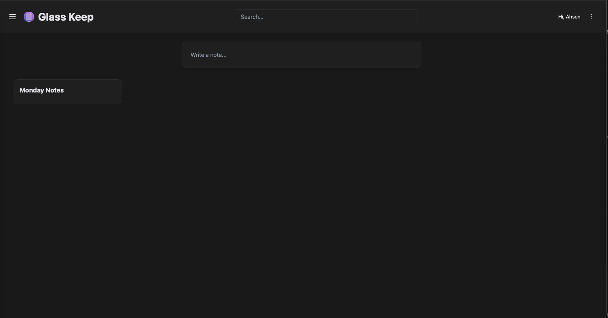

<!-- generated -->

# Glass Keep

1-Click installation template for Glass Keep on Easypanel

## Description

Glass Keep is a lightweight, self-hosted note-taking and organization application designed for personal knowledge management. It provides a clean, intuitive interface for creating, organizing, and managing notes, thoughts, and ideas. Glass Keep features markdown support, rich text editing, categories, tags, and powerful search capabilities to help you find information quickly. Built with Node.js and SQLite, it offers fast performance and easy deployment without requiring complex database setup. All your notes are stored locally in a SQLite database, ensuring privacy and complete control over your data. Perfect for individuals who want a simple, fast, and private note-taking solution without the complexity of larger systems.

## Instructions

Open the web app on your assigned domain. The application uses the ADMIN_EMAILS value from this template to mark admin users. This template uses the Docker image name recommended by the upstream README and pins it to a static version tag instead of latest.For a fresh deployment, the default admin username is admin and the default password is admin. If you set the Admin Email/Username field before first start, that value is used to auto-promote the corresponding admin user(s). Create or manage users using the admin route at https://&lt;your-domain&gt;/#/admin. After login you can change admin settings in the Admin Panel and create additional users as needed.

## Benefits

- Simple & Lightweight: Minimalist design focused on note-taking essentials. Fast, responsive interface with no bloat or unnecessary features.
- Privacy-First: All notes stored locally in SQLite database on your own server. Your thoughts and ideas remain completely private.
- Easy Deployment: Single container deployment with no external database required. SQLite provides reliable storage with zero configuration.

## Features

- Note Management: Create, edit, and organize notes with a clean interface. Support for rich text, markdown, and structured content.
- Categories & Tags: Organize notes with categories and tags for easy retrieval. Build a structured knowledge base that grows with you.
- Search Functionality: Powerful search across all your notes to quickly find the information you need when you need it.
- User Authentication: Secure access with JWT-based authentication. Admin controls for managing users and permissions.
- SQLite Storage: Reliable, fast SQLite database for storing all your notes. No complex database setup or maintenance required.
- Markdown Support: Write notes in markdown format for structured, formatted content that's easy to read and portable.

## Links

- [Website](https://github.com/nikunjsingh93/react-glass-keep)
- [Documentation](https://github.com/nikunjsingh93/react-glass-keep#readme)
- [GitHub](https://github.com/nikunjsingh93/react-glass-keep)
- [Template Source](https://github.com/easypanel-io/templates/tree/main/templates/glasskeep)

## Options

Name | Description | Required | Default Value
-|-|-|-
App Service Name | - | yes | glasskeep
App Service Image | - | yes | nikunjsingh/glass-keep:v20260114-1008
Admin Email/Username | - | yes | 

## Screenshots

## Change Log

- 2025-11-17 – Template Release
- 2026-03-25 – Added logo, pinned Docker image to a static tag, confirmed image name from upstream README, and completed links and instructions.

## Contributors

- [Ahson Shaikh](https://github.com/Ahson-Shaikh)
