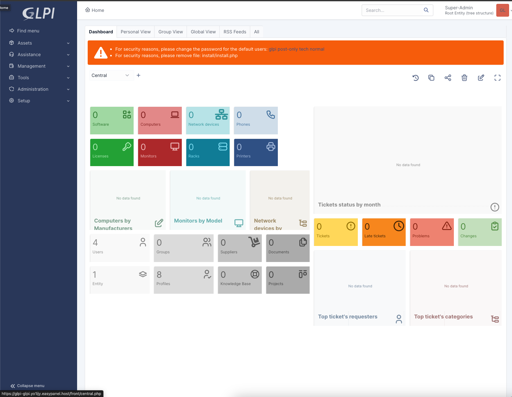

<!-- generated -->

# GLPI

1-Click installation template for GLPI on Easypanel

## Description

GLPI (Gestionnaire Libre de Parc Informatique) is a powerful IT asset management and help desk software designed to streamline IT operations. It offers features like inventory management, ticketing, and reporting, making it an ideal solution for IT teams. With its robust plugin support and user-friendly interface, GLPI provides extensive customization options to adapt to various organizational needs. This containerized version is based on Docker Baseimage KasmVNC, ensuring smooth multi-platform support and flexible deployment.

## Instructions

Default login is; glpi/glpi, and other credentials can be found on the Github repository or during the installation wizard.

## Benefits

- Comprehensive IT Asset Management: GLPI enables organizations to efficiently manage IT assets, track hardware, and maintain an up-to-date inventory.
- Integrated Help Desk System: Includes a robust ticketing system to streamline issue tracking and resolution for IT teams.
- Extensive Customization: Offers a variety of plugins and configuration options to adapt the software to specific organizational requirements.
- Web-Based Interface: Accessible from any device, making IT operations manageable from anywhere.

## Features

- Asset Inventory Management: Track and manage hardware, software, and other IT assets effectively.
- Ticketing System: Manage user requests, incidents, and changes through an intuitive help desk interface.
- Reporting and Statistics: Generate detailed reports to analyze IT performance and identify improvement areas.
- Plugin Support: Enhance GLPI with a variety of plugins developed by the community.
- User and Group Management: Manage roles and permissions to ensure secure access control.
- Multi-Language Support: Available in multiple languages to cater to global organizations.
- Custom Workflows: Define workflows and automate repetitive IT tasks for improved efficiency.
- Integration Capabilities: Integrates with various third-party tools and APIs for extended functionality.
- Centralized IT Management: Centralize IT asset and help desk management for better visibility and coordination.

## Links

- [Documentation](https://glpi-project.org/documentation/)
- [Github](https://github.com/glpi-project/glpi)
- [Template Source](https://github.com/easypanel-io/templates/tree/main/templates/glpi)

## Options

Name | Description | Required | Default Value
-|-|-|-
App Service Name | - | yes | glpi
App Service Image | - | yes | diouxx/glpi

## Screenshots

## Change Log

- 2024-12-31 – Template Release

## Contributors

- [Ahson Shaikh](https://github.com/Ahson-Shaikh)
