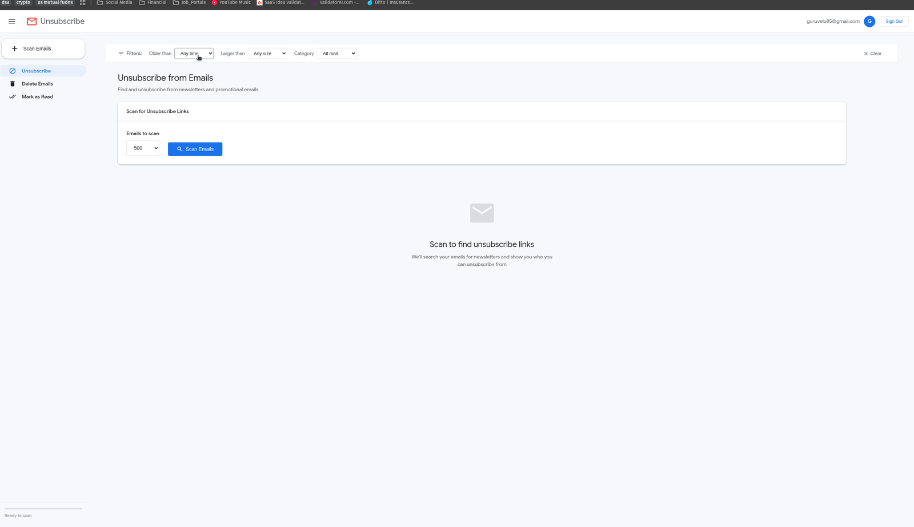

<!-- generated -->

# Gmail Cleaner

1-Click installation template for Gmail Cleaner on Easypanel

## Description

Gmail Cleaner is a privacy-focused self-hosted tool to bulk unsubscribe, delete, archive, and mark Gmail messages as read by sender. It runs locally with your own Google OAuth credentials and keeps auth tokens in persistent storage.

## Instructions

Paste your downloaded Google OAuth client JSON into Credentials JSON before deploying. In Google Cloud Console, add an Authorized redirect URI that uses your OAuth host and external OAuth port (for example, https://your-domain/). After deploy, open the app domain, click Sign In, and complete the OAuth flow.

## Benefits

- Inbox cleanup at scale: Process large amounts of email by sender with bulk actions and filters.
- Privacy-first deployment: Runs on your infrastructure with your own Google credentials.
- Persistent auth and data: Stores OAuth token and app data in a mounted volume.

## Features

- Bulk unsubscribe and delete: Remove unwanted newsletters and sender groups with progress tracking.
- Mark read, archive, and labels: Apply common Gmail mailbox actions in bulk.
- OAuth callback support: Exposes the callback listener port for Google OAuth login flow.

## Links

- [Documentation](https://github.com/Gururagavendra/gmail-cleaner#readme)
- [GitHub](https://github.com/gururagavendra/gmail-cleaner)
- [Setup video](https://youtu.be/CmOWn8Tm5ZE)
- [Container registry](https://github.com/gururagavendra/gmail-cleaner/pkgs/container/gmail-cleaner)
- [Template Source](https://github.com/easypanel-io/templates/tree/main/templates/gmail-cleaner)

## Options

Name | Description | Required | Default Value
-|-|-|-
App Service Name | - | yes | gmail-cleaner
Gmail Cleaner Image | - | yes | ghcr.io/gururagavendra/gmail-cleaner:v1.3.0
Credentials JSON | Paste the full Google OAuth client JSON content | yes | 
OAuth Callback Internal Port | - | no | 8767
OAuth Callback External Port | - | no | 8767
OAuth Host | Hostname used when building OAuth redirect URI | no | $(PRIMARY_DOMAIN)
Enable Web Authentication | - | no | true

## Screenshots

## Change Log

- 2026-04-09 – Initial template release

## Contributors

- [Ahson Shaikh](https://github.com/Ahson-Shaikh)
