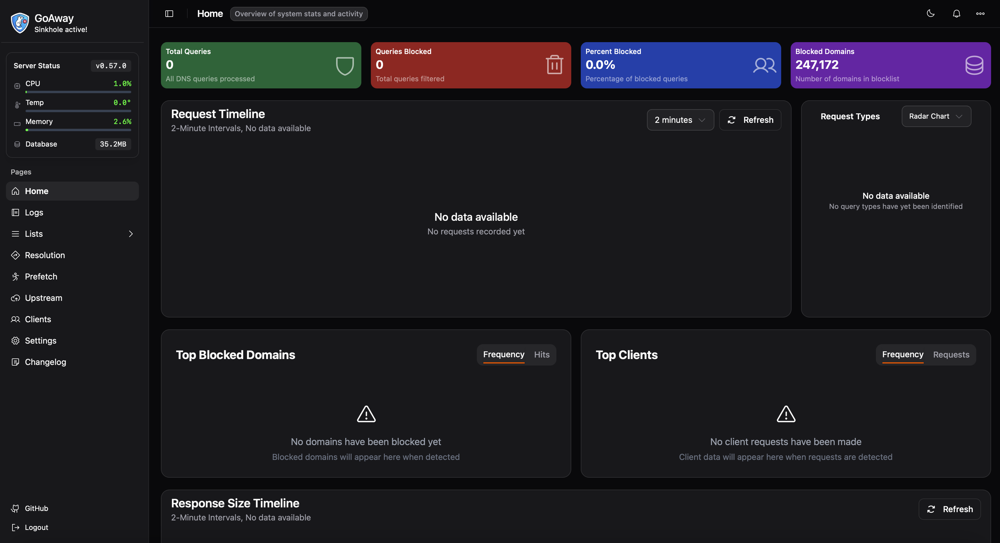

<!-- generated -->

# Goaway

1-Click installation template for Goaway on Easypanel

## Description

Goaway is a DNS service that provides filtering and blocking capabilities for unwanted content. It acts as a DNS server that can block malicious domains, advertisements, and other unwanted traffic while providing a clean web interface for management.

## Instructions

The login credentials are user = admin and password is generated on the startup logs of GoAway inside overview section. In order to mount the DNS port, you have to make sure your host machine has the port 53 not being used by any other service.

## Benefits

- DNS Filtering: Block unwanted domains and malicious content at the DNS level
- Web Interface: Easy-to-use web interface for configuration and monitoring
- Lightweight: Minimal resource usage while providing comprehensive DNS filtering
- Network Protection: Protect your entire network by filtering DNS requests

## Features

- DNS Server: Full-featured DNS server with filtering capabilities
- Domain Blocking: Block access to unwanted or malicious domains
- Web Management: Comprehensive web interface for easy management
- Real-time Monitoring: Monitor DNS queries and blocked requests in real-time
- Custom Configuration: Customize blocking rules and DNS settings
- Network-wide Protection: Protect all devices on your network with centralized DNS filtering

## Links

- [Website](https://pommee.github.io/goaway/)
- [Documentation](https://pommee.github.io/goaway/getting-started/)
- [GitHub](https://github.com/pommee/goaway)
- [Template Source](https://github.com/easypanel-io/templates/tree/main/templates/goaway)

## Options

Name | Description | Required | Default Value
-|-|-|-
App Service Name | - | yes | goaway
App Service Image | - | yes | pommee/goaway:0.57.0
DNS Port | The port to use for DNS queries. | no | 53

## Screenshots

## Change Log

- 2025-07-09 – Initial release
- 2026-04-19 – Square logo; website and documentation links

## Contributors

- [Ahson Shaikh](https://github.com/Ahson-Shaikh)
