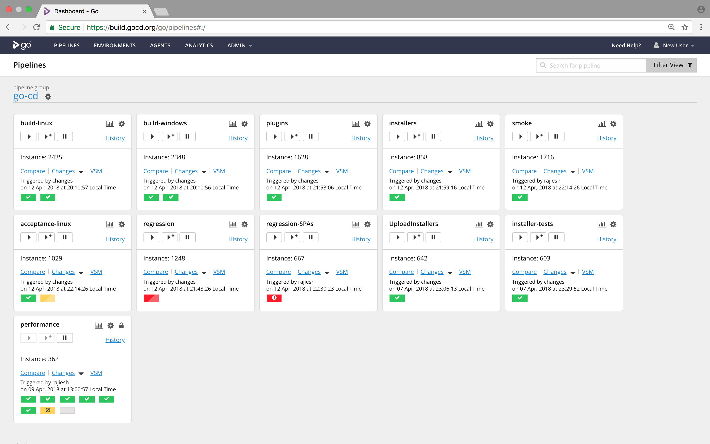

<!-- generated -->

# GoCD

1-Click installation template for GoCD on Easypanel

## Description

GoCD is a continuous delivery and release automation server. It helps you automate and streamline your build-test-release cycle, making it easy to manage complex deployment pipelines. GoCD provides end-to-end visibility and traceability from commit to deployment, with the ability to model complex workflows and dependencies with ease. It supports parallel and sequential execution, and provides powerful value stream visualization to help you optimize your delivery process.

## Instructions

Open GoCD from your domain, complete the first-time admin login flow, then create your initial pipeline and connect your source repository and build agents.

## Benefits

- Continuous Delivery: Model and visualize complex workflows with ease, from commit to deployment.
- Value Stream Map: Trace a commit from check-in to deployment and understand dependencies.
- Pipeline Organization: Group pipelines into pipeline groups for better organization and management.
- Advanced Workflows: Support for parallel and sequential execution, fan-in/fan-out, and dependencies.
- Security & Access Control: Role-based access control and authentication integration with LDAP/AD.

## Features

- Pipeline Management: Create and manage complex deployment pipelines with ease.
- Environment Management: Define and manage different environments for testing and deployment.
- Agent Management: Manage build agents and their resources efficiently.
- Artifact Management: Store and version artifacts with built-in artifact repository.
- Plugin System: Extend functionality with a wide range of plugins.

## Links

- [Website](https://www.gocd.org/)
- [Documentation](https://docs.gocd.org/)
- [Github](https://github.com/gocd/gocd)
- [Template Source](https://github.com/easypanel-io/templates/tree/main/templates/gocd)

## Options

Name | Description | Required | Default Value
-|-|-|-
App Service Name | - | yes | gocd-server
App Service Image | - | yes | gocd/gocd-server:v25.4.0

## Screenshots

## Change Log

- 2024-03-04 – First Release
- 2026-04-29 – Version bumped to v25.4.0

## Contributors

- [Ahson Shaikh](https://github.com/Ahson-Shaikh)
