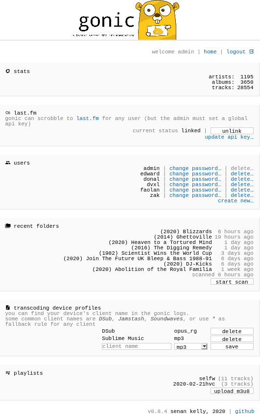

<!-- generated -->

# Gonic

1-Click installation template for Gonic on Easypanel

## Description

Gonic is a music streaming server / subsonic server API implementation, written in Go. It provides a simple and efficient way to stream your music collection through a web interface or compatible clients. Gonic supports various audio formats and offers features like transcoding, cover art, and playlist management.

## Instructions

Login credentials are admin/admin

## Benefits

- Self-Hosted Music Streaming: Host your own music streaming server with full control over your music collection and privacy.
- Subsonic API Compatible: Compatible with a wide range of Subsonic clients, allowing you to use your preferred music player.
- Efficient and Fast: Built in Go for high performance and low resource usage, making it perfect for home servers.
- Transcoding Support: Automatically transcodes audio files to different formats based on client requirements and bandwidth.

## Features

- Music Streaming: Stream your music collection through a web interface or compatible Subsonic clients.
- Podcast Support: Manage and stream your podcast collection alongside your music.
- Playlist Management: Create, manage, and share playlists with support for various playlist formats.
- Cover Art: Automatic cover art detection and display for albums and tracks.
- Transcoding: On-the-fly audio transcoding to optimize streaming for different devices and bandwidth.
- Jukebox Mode: Optional jukebox mode for direct audio output on the server.
- Web Interface: Clean and responsive web interface for browsing and playing your music collection.

## Links

- [Documentation](https://github.com/sentriz/gonic/wiki)
- [Github](https://github.com/sentriz/gonic)
- [DockerHub](https://hub.docker.com/r/sentriz/gonic)
- [Template Source](https://github.com/easypanel-io/templates/tree/main/templates/gonic)

## Options

Name | Description | Required | Default Value
-|-|-|-
App Service Name | - | yes | gonic
App Service Image | - | yes | sentriz/gonic:v0.18.0

## Screenshots

## Change Log

- 2025-09-23 – Initial template release (v0.18.0)

## Contributors

- [Ahson Shaikh](https://github.com/Ahson-Shaikh)
