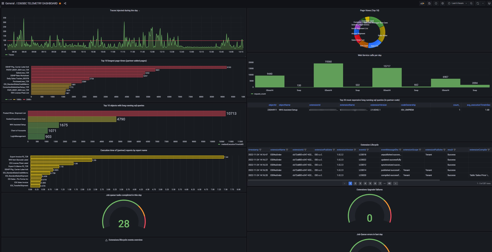

<!-- generated -->

# Grafana OTEL LGTM

1-Click installation template for Grafana OTEL LGTM on Easypanel

## Description

Grafana OTEL LGTM is an all-in-one OpenTelemetry backend bundled into a single Docker image. It includes the OpenTelemetry Collector, Prometheus for metrics, Grafana Loki for logs, Grafana Tempo for traces, Grafana Pyroscope for application profiles, and Grafana for unified visualization. The collector automatically routes telemetry signals to the correct backend — metrics to Prometheus, logs to Loki, traces to Tempo, and profiles to Pyroscope. It works out of the box with OpenTelemetry&#39;s default settings, so applications instrumented with any OpenTelemetry SDK can send data immediately. Optional eBPF auto-instrumentation (OBI) can generate traces and RED metrics for HTTP/gRPC services with zero code changes.

## Instructions

After deployment, access the Grafana dashboard via the service domain. 
Log in with the default credentials: username &quot;admin&quot;, password
&quot;admin&quot;. All data sources (Prometheus, Loki, Tempo, Pyroscope) are
pre-configured. Point your OpenTelemetry-instrumented applications to the
OTLP endpoints — port 4317 for gRPC and port 4318 for HTTP. No additional
configuration is needed; the image works with OpenTelemetry defaults.

## Benefits

- Complete Observability in One Container: Bundles OpenTelemetry Collector, Prometheus, Loki, Tempo, Pyroscope, and Grafana into a single image. Deploy a full observability stack in seconds with zero configuration.
- Zero-Config OpenTelemetry Backend: Works with OpenTelemetry's default settings out of the box. Any application instrumented with an OpenTelemetry SDK can send data immediately without endpoint configuration.
- Unified Visualization: Grafana comes pre-configured with all data sources connected. Explore metrics, logs, traces, and profiles from a single dashboard with built-in correlation between signals.
- Multi-Language Support: Compatible with OpenTelemetry SDKs for Java, Go, Python, .NET, Node.js, Ruby, and any language with OTLP support.

## Features

- Automatic Signal Routing: The OpenTelemetry Collector automatically routes metrics to Prometheus, logs to Loki, traces to Tempo, and profiles to Pyroscope without manual pipeline configuration.
- OTLP gRPC & HTTP Endpoints: Accepts telemetry data on port 4317 (gRPC) and port 4318 (HTTP) using the standard OpenTelemetry Protocol for maximum SDK compatibility.
- Application Profiling: Grafana Pyroscope captures continuous application profiles for CPU, memory, and other runtime metrics to identify performance bottlenecks.
- eBPF Auto-Instrumentation: Optional OBI support uses eBPF to automatically generate traces and RED metrics for HTTP/gRPC services with zero code changes (Linux kernel 5.8+ required).
- Persistent Data Storage: All components write to a single /data directory. Mount a volume to persist metrics, logs, traces, and profiles across container restarts.
- Configurable Logging: Enable debug logging for individual components (Grafana, Loki, Prometheus, Tempo, Pyroscope, OTel Collector) or all at once via environment variables.

## Links

- [Website](https://grafana.com/)
- [GitHub](https://github.com/grafana/docker-otel-lgtm)
- [Documentation](https://grafana.com/docs/opentelemetry/docker-lgtm)
- [Docker Hub](https://hub.docker.com/r/grafana/otel-lgtm)
- [Template Source](https://github.com/easypanel-io/templates/tree/main/templates/grafana-otel-lgtm)

## Options

Name | Description | Required | Default Value
-|-|-|-
App Service Name | - | yes | grafana-otel-lgtm
Grafana OTEL LGTM Image | - | yes | grafana/otel-lgtm:0.22.0
OTLP Port | - | no | 4317
OTLP HTTP Port | - | no | 4318

## Screenshots

## Change Log

- 2026-02-20 – Template Release

## Contributors

- [Ahson Shaikh](https://github.com/Ahson-Shaikh)
