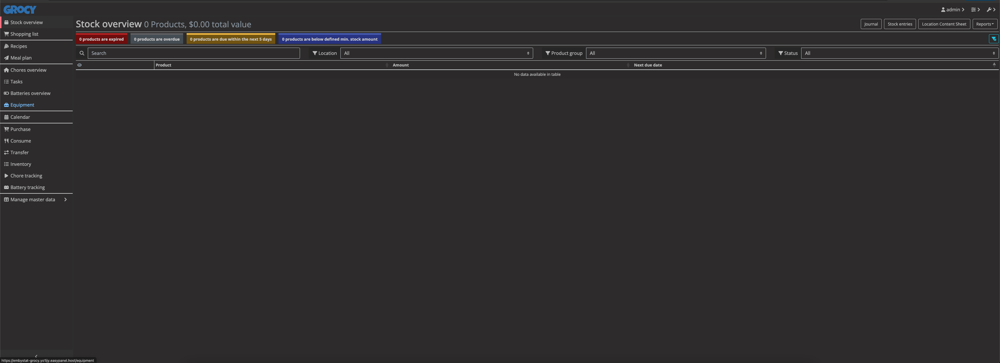

<!-- generated -->

# Grocy

1-Click installation template for Grocy on Easypanel

## Description

Grocy is a self-hosted groceries and household management solution. It helps you streamline your daily chores, track inventory, manage shopping lists, plan meals, and keep tabs on household tasks. With Grocy, you can efficiently manage your pantry, reduce waste, and optimize your shopping experience. Grocy provides a user-friendly interface to organize your household activities and track consumables with expiration dates, giving you better control over your time and resources.

## Instructions

default credentials; username; admin, password; admin

## Benefits

- Efficient Inventory Management: Keep track of your pantry and household inventory, ensuring you never run out of essentials or waste expired items.
- Meal Planning and Shopping Lists: Plan meals and automatically generate shopping lists based on your recipes, saving you time and reducing waste.
- Task and Chore Management: Stay organized by assigning and tracking household chores, ensuring nothing gets overlooked.
- Reduce Food Waste: Monitor expiration dates for perishable items, helping you reduce food waste and save money.

## Features

- Comprehensive Inventory Tracking: Grocy lets you track all your household consumables with detailed information, including expiration dates, quantity, and usage.
- Recipe Management: Store and organize your favorite recipes, linking them with inventory items for seamless meal planning.
- Barcode Scanning: Use barcode scanning to quickly add or remove items from your inventory.
- Task and Chore Scheduler: Assign tasks and manage recurring chores with a built-in scheduler.
- Mobile Access: Access Grocy on the go using mobile apps or a responsive web interface.

## Links

- [Website](https://grocy.info/)
- [Documentation](https://github.com/grocy/docs)
- [Github](https://github.com/grocy/grocy)
- [Template Source](https://github.com/easypanel-io/templates/tree/main/templates/grocy)

## Options

Name | Description | Required | Default Value
-|-|-|-
App Service Name | - | yes | grocy
App Service Image | - | yes | lscr.io/linuxserver/grocy:latest

## Screenshots

## Change Log

- 2024-12-24 – First release

## Contributors

- [Ahson Shaikh](https://github.com/MuhammadAhsanDonuts)
