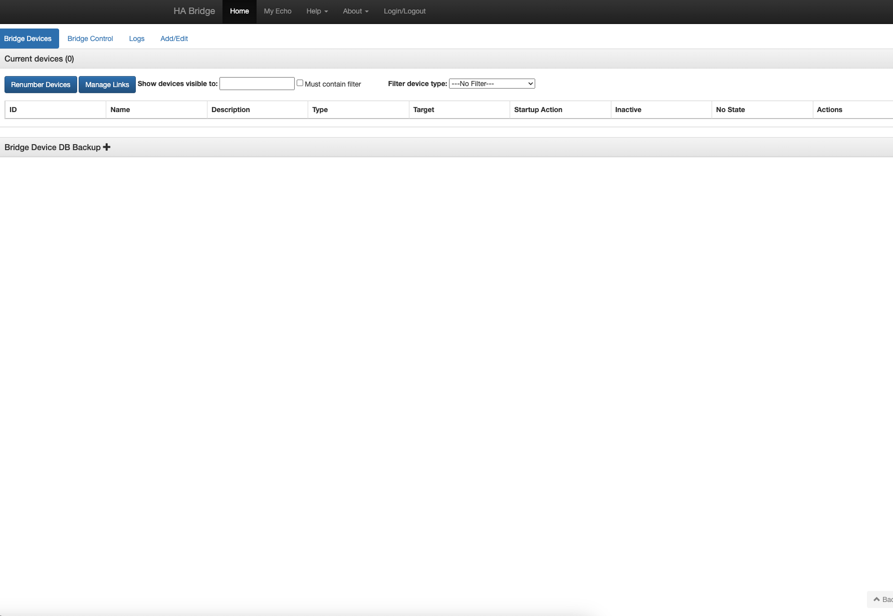

<!-- generated -->

# Habridge

1-Click installation template for Habridge on Easypanel

## Description

Habridge is an open-source software solution that emulates Philips Hue bridges, enabling the integration of various smart devices with home automation systems. It provides a simple yet powerful interface for controlling and managing smart lights, switches, and other IoT devices. Habridge supports a wide range of integrations, including Amazon Alexa, Google Home, and custom APIs, allowing users to create a seamless smart home experience. With its focus on flexibility and ease of use, Habridge empowers users to control their home automation setup with precision and efficiency.

## Benefits

- Seamless Smart Home Integration: Habridge acts as a virtual bridge, enabling seamless integration of smart devices with popular home automation platforms.
- Open-Source and Customizable: As an open-source tool, Habridge is free to use and customize, making it accessible and adaptable to unique user needs.
- Broad Compatibility: Supports integrations with Amazon Alexa, Google Home, and custom APIs for controlling a wide range of smart devices.
- User-Friendly Interface: Provides an intuitive interface for managing devices, commands, and automation rules without requiring advanced technical knowledge.
- Community-Driven Development: Habridge benefits from a passionate community of developers and users who contribute to its growth and provide valuable support.

## Features

- Device Emulation: Habridge emulates a Philips Hue bridge, enabling control of non-Hue devices via Hue-compatible platforms.
- Voice Assistant Integration: Works seamlessly with Amazon Alexa and Google Home for voice-controlled automation.
- Custom Command Support: Allows users to create custom commands and scripts for advanced automation scenarios.
- Broad Device Support: Supports a wide range of smart devices, including lights, switches, and other IoT products.
- API Integration: Provides API support for connecting with custom applications and third-party services.
- Configurable Scenes and Groups: Users can create and manage scenes and groups for dynamic control of multiple devices simultaneously.
- Community Support: An active community offers extensive documentation, tutorials, and forums for troubleshooting and enhancements.

## Links

- [Website](https://github.com/bwssytems/ha-bridge)
- [Github](https://github.com/bwssytems/ha-bridge)
- [Template Source](https://github.com/easypanel-io/templates/tree/main/templates/habridge)

## Options

Name | Description | Required | Default Value
-|-|-|-
App Service Name | - | yes | habridge
App Service Image | - | yes | linuxserver/habridge:5.4.1

## Screenshots

## Change Log

- 2024-12-27 – First Release

## Contributors

- [Ahson Shaikh](https://github.com/Ahson-Shaikh)
