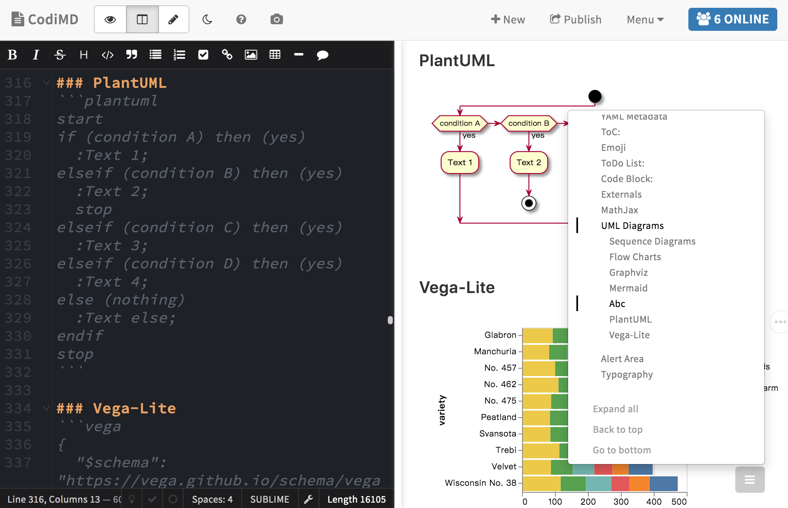

<!-- generated -->

# HackMD

1-Click installation template for HackMD on Easypanel

## Description

HackMD is a simple and powerful note-taking app that allows you to create notes, write and organize your thoughts, and collaborate with others in real time. It&#39;s a great tool for anyone who wants to stay organized and productive while working remotely or on the go.

## Benefits

- No-Code Collaboration: The app provides a no-code collaboration experience, allowing you to collaborate on documents in real time. This eliminates the need for manual sharing and ensures that all changes are tracked and saved.
- No-Code Note Taking: The app provides a no-code note taking experience, allowing you to create notes, write and organize your thoughts, and collaborate with others in real time. This eliminates the need for manual note taking and ensures that all notes are saved and accessible.
- No-Code Organization: The app provides a no-code organization experience, allowing you to organize your notes, tasks, and other content in a structured and intuitive way. This eliminates the need for manual organization and ensures that all content is easily accessible and searchable.

## Links

- [Website](https://hackmd.io/)
- [Github](https://github.com/hackmdio/codimd)
- [Template Source](https://github.com/easypanel-io/templates/tree/main/templates/hackmdio)

## Options

Name | Description | Required | Default Value
-|-|-|-
App Service Name | - | yes | hackmd
App Service Image | - | yes | nabo.codimd.dev/hackmdio/hackmd:2.6.0
Database Service Name | - | yes | hackmd-db

## Screenshots

## Change Log

- 2024-11-27 – first release
- 2025-07-21 – Version bumped to 2.6.0

## Contributors

- [Serban Alexandru](https://github.com/serban-alexandru)
- [Ahson Shaikh](https://github.com/Ahson-Shaikh)
