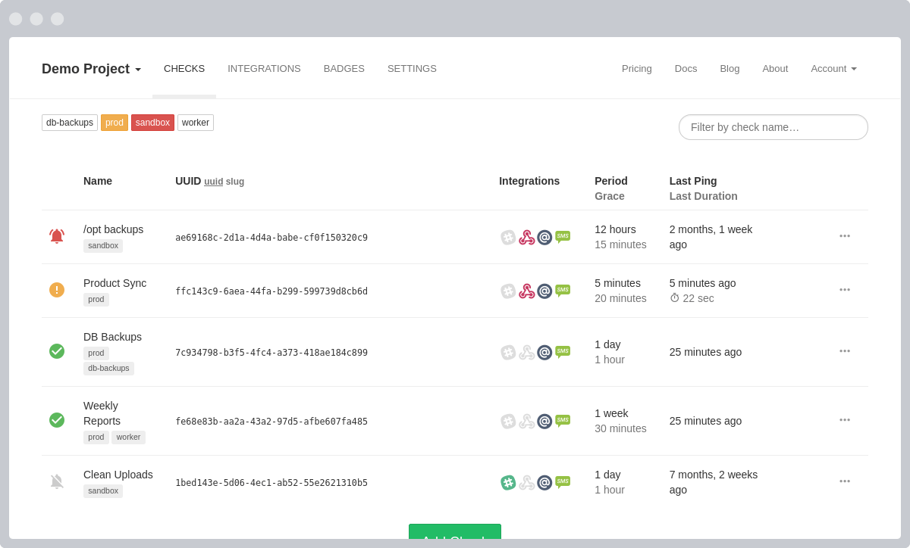

<!-- generated -->

# Healthchecks.io

1-Click installation template for Healthchecks.io on Easypanel

## Description

Healthchecks.io is an open-source application designed for monitoring cron jobs, periodic tasks, and application endpoints. It provides a lightweight and efficient way to ensure critical processes are running as expected. Healthchecks.io integrates with a wide range of notification methods, allowing users to be alerted when tasks fail to execute within their expected intervals. With its user-friendly interface and robust feature set, Healthchecks.io empowers users to maintain reliable task execution and system monitoring.

## Benefits

- Cron Job and Task Monitoring: Healthchecks.io monitors cron jobs and periodic tasks, ensuring critical operations run smoothly.
- Open-Source and Lightweight: A free and open-source solution that is easy to deploy and customize for your specific monitoring needs.
- Flexible Notifications: Supports notifications via email, Slack, Telegram, and other integrations for timely alerts.
- User-Friendly Interface: Provides a clean and simple web dashboard for setting up and managing checks.
- Self-Hosted Option: Can be self-hosted for complete control over your monitoring data.

## Features

- Task Monitoring: Tracks periodic tasks, ensuring they execute within expected timeframes.
- Notification Integrations: Connects with popular notification channels for instant alerts when checks fail.
- Grace Periods: Configurable grace periods to account for minor delays in task execution.
- Multi-Check Management: Monitor multiple tasks with unique checks and organize them into projects.
- Open-Source Community: A thriving open-source community provides updates, support, and enhancements.
- Easy Deployment: Deployable with Docker and compatible with various hosting environments.

## Links

- [Website](https://healthchecks.io)
- [Github](https://github.com/healthchecks/healthchecks)
- [Template Source](https://github.com/easypanel-io/templates/tree/main/templates/healthchecks)

## Options

Name | Description | Required | Default Value
-|-|-|-
App Service Name | - | yes | healthchecks
App Service Image | - | yes | lscr.io/linuxserver/healthchecks:3.9.20241224
Superuser Username | - | yes | admin@example.com
Superuser Password | - | yes | password
SMTP Host | - | yes | smtp.example.com
SMTP Port | - | yes | 587
SMTP Host Username | - | yes | smtpUser
SMTP Host Password | - | yes | smtpPassword
Enable TLS | - | yes | true

## Screenshots

## Change Log

- 2024-12-27 – First Release

## Contributors

- [Ahson Shaikh](https://github.com/Ahson-Shaikh)
