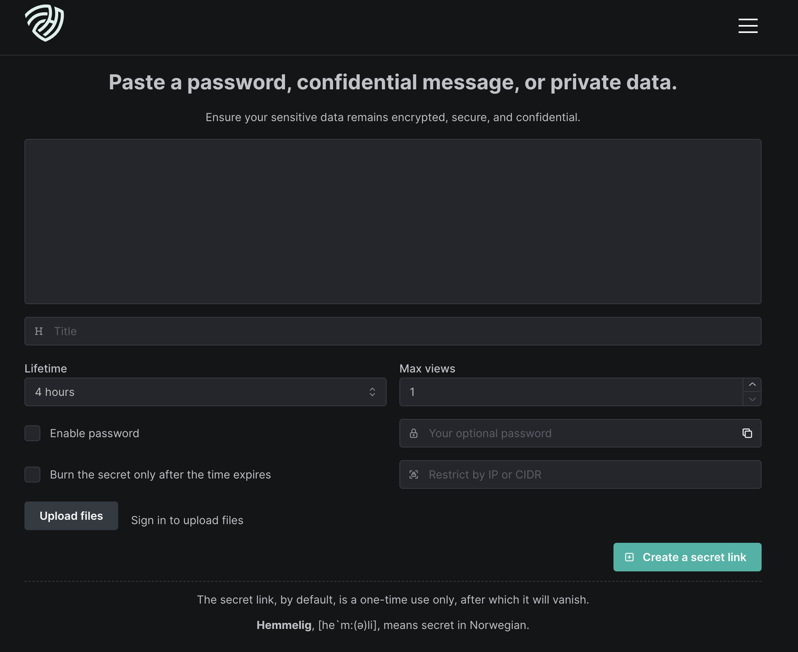

<!-- generated -->

# Hemmelig

1-Click installation template for Hemmelig on Easypanel

## Description

Hemmelig is a secure, self-hosted secret sharing platform that allows you to share sensitive information like passwords, API keys, and confidential documents safely. Built with security in mind, Hemmelig provides end-to-end encryption, expiration dates, and access controls to ensure your secrets remain protected. Perfect for teams, developers, and organizations who need to share sensitive information securely without relying on external services.

## Instructions

v7 uses BetterAuth and SQLite — no initial admin credentials are needed in the config. Register your first account via the web UI after deployment.

## Benefits

- Secure Secret Sharing: Share sensitive information like passwords, API keys, and confidential documents with end-to-end encryption and security controls.
- Self-Hosted Security: Maintain complete control over your sensitive data by hosting Hemmelig on your own infrastructure instead of relying on external services.
- End-to-End Encryption: Your secrets are encrypted at rest and in transit, ensuring maximum security for your sensitive information.
- Access Controls: Control who can access your shared secrets with configurable permissions, expiration dates, and access logs.
- File and Text Support: Share both text-based secrets and file uploads with configurable size limits and security settings.
- Audit Trail: Track access to your shared secrets with comprehensive logging and audit capabilities.

## Features

- Secret Management: Create, share, and manage secrets with secure encryption and access controls for sensitive information.
- File Uploads: Upload and share confidential files with configurable size limits and security settings.
- Text Sharing: Share text-based secrets like passwords, API keys, and configuration data with encryption.
- Expiration Dates: Set automatic expiration dates for your shared secrets to ensure they don't remain accessible indefinitely.
- Access Controls: Configure who can access your shared secrets with password protection and access permissions.
- Admin Dashboard: Manage your Hemmelig instance through a comprehensive admin dashboard with user and secret management.
- Multi-Language Support: Support for multiple languages with configurable default language settings.
- Data Persistence: Your secrets, files, and configuration are stored securely and persist across container restarts and updates.

## Links

- [Website](https://hemmelig.app)
- [GitHub](https://github.com/HemmeligOrg/Hemmelig.app)
- [Template Source](https://github.com/easypanel-io/templates/tree/main/templates/hemmelig)

## Options

Name | Description | Required | Default Value
-|-|-|-
App Service Name | - | yes | hemmelig
App Service Image | - | yes | hemmeligapp/hemmelig:v7.4.8

## Screenshots

## Change Log

- 2026-05-19 – Updated to v7.4.8
- 2025-07-16 – First Release

## Contributors

- [Ahson Shaikh](https://github.com/Ahson-Shaikh)
