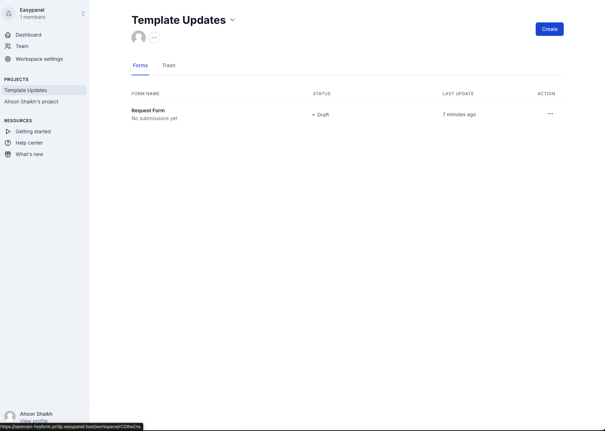

<!-- generated -->

# HeyForm

1-Click installation template for HeyForm on Easypanel

## Description

HeyForm is an open-source form builder platform designed to create, manage, and share forms with ease. It simplifies form creation workflows for businesses, developers, and individuals by offering intuitive UI components and backend management. HeyForm provides robust support for form encryption, session management, and integrations with third-party services like MongoDB and Redis. Its flexible API allows developers to customize and extend functionalities while ensuring data security. HeyForm&#39;s clean design and modular architecture make it scalable and adaptable for growing business needs, enabling effective form creation, storage, and analysis.

## Benefits

- Simplified Form Creation: HeyForm makes it easy to create and manage forms using a user-friendly interface and backend support.
- Data Security: HeyForm supports robust form encryption, ensuring your collected data remains secure.
- Flexible API-Driven Architecture: HeyForm’s API-first design enables developers to extend and customize the platform as needed.
- Seamless Integrations: Integrate with MongoDB for storage and Redis for session management and performance enhancements.
- Scalable Platform: HeyForm’s modular architecture makes it highly scalable, adapting to the growing needs of any business.

## Features

- Drag-and-Drop Form Builder: Use an intuitive drag-and-drop interface to create forms quickly without coding.
- Form Encryption: Ensure form data is encrypted to maintain privacy and compliance.
- MongoDB Backend: Leverage MongoDB to store and manage form submissions efficiently.
- Redis Integration: Use Redis for caching and session management to improve form response performance.
- Customizable Templates: Choose from pre-built templates or create custom forms tailored to your needs.
- API-Driven Design: Automate and programmatically manage forms, submissions, and configurations using HeyForm's RESTful API.
- Multi-Tenancy Support: Manage multiple projects or teams under a single instance of HeyForm.
- Notifications and Integrations: Configure email notifications and integrate with third-party tools to automate workflows.

## Links

- [Website](https://heyform.net/)
- [Documentation](https://docs.heyform.net)
- [GitHub](https://github.com/heyform/heyform)
- [Template Source](https://github.com/easypanel-io/templates/tree/main/templates/heyform)

## Options

Name | Description | Required | Default Value
-|-|-|-
App Service Name | - | yes | heyform
HeyForm Service Image | - | yes | heyform/community-edition:v0.0.15
Database Service Image | - | yes | percona/percona-server-mongodb:4.4
Redis Service Image | - | yes | eqalpha/keydb:x86_64_v6.3.4

## Screenshots

## Change Log

- 2024-12-12 – First release

## Contributors

- [Ahson Shaikh](https://github.com/Ahson-Shaikh)
