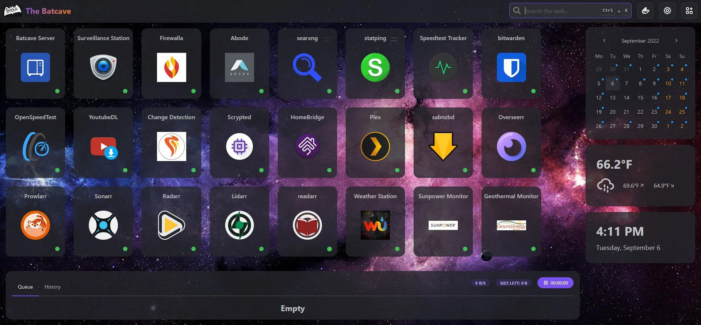

<!-- generated -->

# Homarr

1-Click installation template for Homarr on Easypanel

## Description

Homarr is a powerful dashboard designed to simplify the management of your server. It provides a sleek, modern interface that brings all your apps and services together in one place, allowing you to access and control everything with ease. Homarr seamlessly integrates with the apps you&#39;ve added, offering valuable insights and complete control. You can add your self-hosted applications or favorite websites to your dashboard and organize them as you like. Homarr supports integration with many popular applications to enhance your user experience. It is customizable, accessible, and supports 23 languages. With Homarr, you can control and monitor your network directly, use integrations to display data and control apps, and even create your own dashboard using a comprehensible and easy-to-use visual editor. Homarr is open-source and allows commercial usage. It features a quick search function to easily navigate through your apps and supported integrations.

## Instructions

On first launch, Homarr will display an onboarding wizard. Create your admin account to get started.

## Benefits

- Centralized Dashboard: Create a single, unified dashboard that serves as the starting point for all your self-hosted services and applications, eliminating the need to remember multiple URLs and bookmarks.
- Customizable Interface: Highly customizable interface with drag-and-drop widgets, customizable themes, and flexible layout options to match your personal preferences and workflow.
- Service Monitoring: Built-in service monitoring capabilities with status indicators and health checks to quickly identify which services are running and accessible.
- Responsive Design: Fully responsive design that works seamlessly across desktop, tablet, and mobile devices, providing consistent access to your services from anywhere.

## Features

- Widget System: Comprehensive widget system with support for various widgets including weather, system information, service status, and custom integrations for enhanced functionality.
- Bookmark Management: Organize and categorize your bookmarks with support for custom icons, descriptions, and grouping to create a personalized navigation experience.
- Theme Customization: Multiple built-in themes with customizable colors, fonts, and layouts to create a personalized dashboard that matches your aesthetic preferences.
- Service Integration: Easy integration with popular self-hosted services including Plex, Sonarr, Radarr, and many others with automatic service discovery and status monitoring.
- Search Functionality: Built-in search functionality to quickly find and access your bookmarked services and applications across your entire dashboard.
- Data Persistence: All dashboard configurations, bookmarks, and customizations persist across container restarts and updates with encrypted local storage.
- Multi-User Support: Support for multiple user accounts with individual dashboard configurations and preferences for team or family use.
- API Integration: RESTful API support for programmatic access and integration with other applications and automation tools.

## Links

- [Website](https://homarr.dev)
- [GitHub](https://github.com/homarr-labs/homarr)
- [Documentation](https://homarr.dev/docs/getting-started/)
- [Easypanel Documentation](https://homarr.dev/docs/getting-started/installation/easy-panel)
- [Template Source](https://github.com/easypanel-io/templates/tree/main/templates/homarr)

## Options

Name | Description | Required | Default Value
-|-|-|-
App Service Name | - | yes | homarr
App Service Image | - | yes | ghcr.io/homarr-labs/homarr:v1.53.2
Timezone | Timezone for the application | yes | Australia/Melbourne

## Screenshots

## Change Log

- 2025-10-07 – First Release
- 2024-10-11 – Version jumped to 0.15.4
- 2025-02-25 – Version bumped to 0.15.10
- 2025-12-25 – Version bumped to 0.16.0
- 2026-02-24 – Version bumped to 1.53.2

## Contributors

- [Ahson Shaikh](https://github.com/Ahson-Shaikh)
