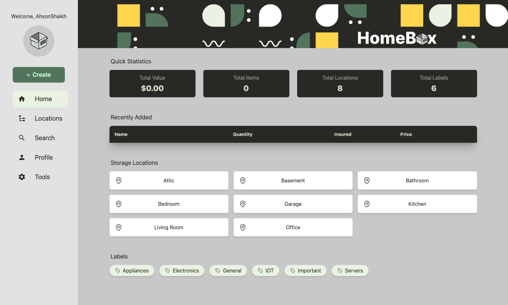
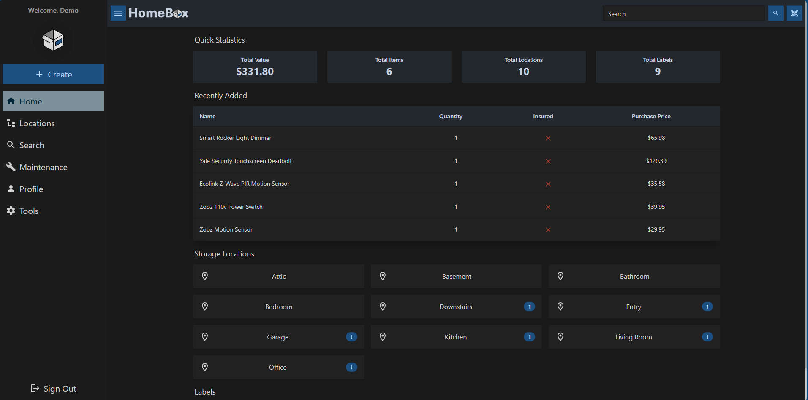

<!-- generated -->

# Homebox

1-Click installation template for Homebox on Easypanel

## Description

Homebox is an inventory management system that helps you keep track of your belongings, their location, and other details to simplify home organization.

## Benefits

- Home Inventory Management: Keep track of all your belongings in one place
- Location Tracking: Track where items are stored within your home
- Search & Filter: Quickly find items when you need them
- Self-Hosted: Keep your inventory data private on your own server
- Open Source: Free and open-source inventory management system

## Features

- Item Catalog: Catalog all your belongings with details and photos
- Location Management: Organize items by location and sub-locations
- Labels & Tags: Categorize items with custom labels and tags
- Item History: Track maintenance, warranty, and purchase information
- Mobile Friendly: Access your inventory from any device

## Links

- [Website](https://homebox.software/en/)
- [GitHub](https://github.com/sysadminsmedia/homebox)
- [Documentation](https://homebox.software/en/quick-start/)
- [Template Source](https://github.com/easypanel-io/templates/tree/main/templates/homebox)

## Options

Name | Description | Required | Default Value
-|-|-|-
App Service Name | - | yes | homebox
App Service Image | - | yes | ghcr.io/sysadminsmedia/homebox:0.11.1

## Screenshots

## Change Log

- 2025-04-14 – First Release

## Contributors

- [Ahson Shaikh](https://github.com/Ahson-Shaikh)
