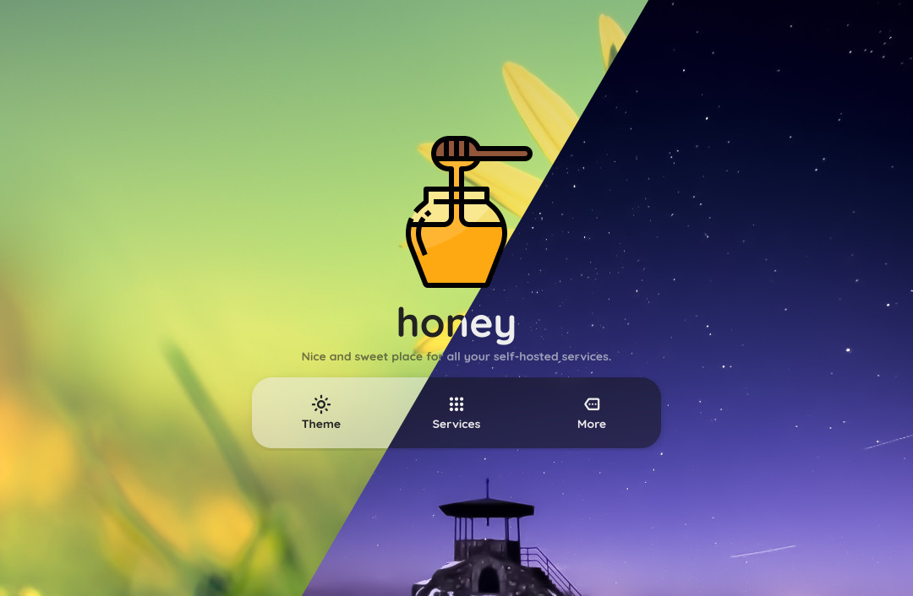

<!-- generated -->

# Honey

1-Click installation template for Honey on Easypanel

## Description

Honey is a lightweight web application developed by dani3l0. It provides a clean and intuitive interface for accessing and managing your data. The application is containerized for easy deployment and configuration, making it ideal for self-hosted environments. Honey uses a file-based configuration system, allowing for simple customization and persistence across container restarts. With its efficient design and minimal resource requirements, Honey is a great addition to any self-hosted service collection.

## Benefits

- Easy Deployment: Honey is packaged as a Docker container for simple deployment in any environment that supports Docker, making it easy to set up and run.
- Persistent Configuration: Store your configuration files externally to maintain settings between container restarts and updates, ensuring a consistent experience.
- Resource Efficient: With a lightweight design and minimal resource requirements, Honey operates efficiently even on modest hardware setups.

## Features

- Web Interface: Access Honey through a clean, modern web interface that works across different devices and screen sizes.
- File-based Configuration: Configure Honey using simple configuration files, giving you complete control over your instance's behavior and settings.
- Containerized Application: Run Honey in an isolated container environment for improved security and simplified dependency management.
- Fast Startup: Honey's lightweight nature allows for quick startup times, getting you up and running with minimal delay.
- Easy Updates: Update to the latest version simply by pulling the newest container image and restarting the service while maintaining your configuration.

## Links

- [Demo](https://honeyy.vercel.app)
- [GitHub](https://github.com/dani3l0/honey)
- [Container](https://github.com/dani3l0/honey/pkgs/container/honey)
- [Template Source](https://github.com/easypanel-io/templates/tree/main/templates/honey)

## Options

Name | Description | Required | Default Value
-|-|-|-
App Service Name | - | yes | honey
App Service Image | - | yes | ghcr.io/dani3l0/honey:v2.4.1

## Screenshots

## Change Log

- 2025-04-17 – first release

## Contributors

- [Ahson Shaikh](https://github.com/Ahson-Shaikh)
