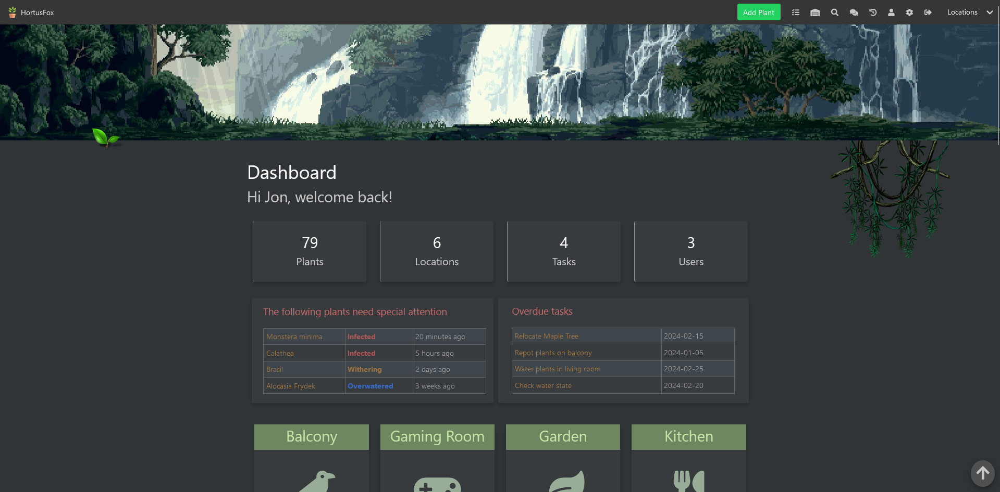

<!-- generated -->

# HortusFox

1-Click installation template for HortusFox on Easypanel

## Description

HortusFox is a free, open-source, self-hosted, collaborative plant management system designed for individuals and groups to easily manage their plants, tasks, calendar, inventory, and more, all within a user-friendly web application.

## Benefits

- Collaborative Plant Management: Easily manage and share plant care responsibilities among individuals and groups.
- Comprehensive Task & Calendar Integration: Organize tasks and schedule plant care with integrated calendar features.
- Self-Hosted & Open Source: Enjoy full control over your data with a free, open-source solution.

## Features

- Plant Inventory Management: Track and manage your plant collection with detailed records.
- Task Scheduling: Create, assign, and track tasks related to plant care and maintenance.
- Calendar Integration: Plan and view plant care schedules seamlessly with an integrated calendar.
- Collaborative Tools: Share responsibilities and collaborate with group members effectively.

## Links

- [Documentation](https://hortusfox.github.io/)
- [Github](https://github.com/danielbrendel/hortusfox-web?tab=readme-ov-file#docker)
- [Template Source](https://github.com/easypanel-io/templates/tree/main/templates/hortusfox)

## Options

Name | Description | Required | Default Value
-|-|-|-
App Service Name | - | yes | hortusfox
App Service Image | - | yes | ghcr.io/danielbrendel/hortusfox-web:v4.4
Admin Email | - | yes | admin@example.com
Admin Password | - | yes | password

## Screenshots

## Change Log

- 2025-03-14 – Template Release (v4.4)

## Contributors

- [Ahson Shaikh](https://github.com/Ahson-Shaikh)
