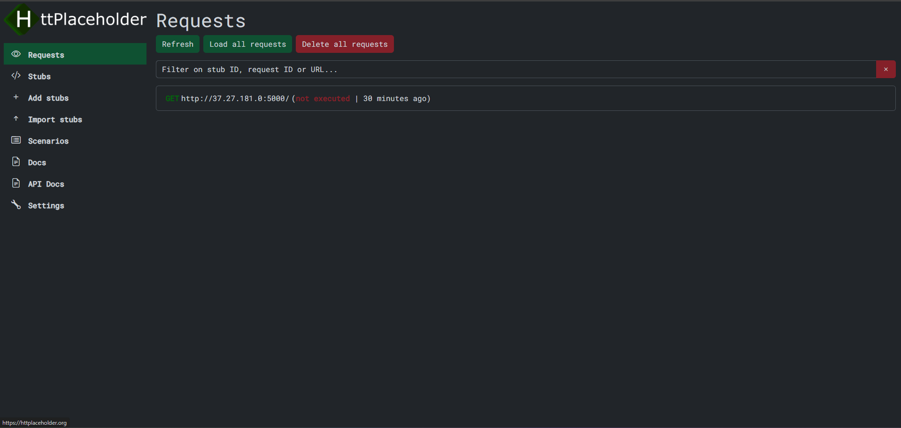

<!-- generated -->

# HTTP Placeholder

1-Click installation template for HTTP Placeholder on Easypanel

## Description

HTTP Placeholder is a powerful API mocking tool that allows you to create mock HTTP endpoints for testing and development purposes. It provides a simple way to simulate API responses and test your applications without relying on real backend services.

## Instructions

After installation, access the web interface through the provided domain to start creating and managing your mock endpoints.

## Benefits

- API Mocking: Create and manage mock HTTP endpoints for testing and development.
- Development Testing: Test your applications without relying on real backend services.
- Response Customization: Customize mock responses with different status codes, headers, and body content.
- Database Integration: Store and manage mock data in a PostgreSQL database.
- Easy Setup: Quick and simple setup process for creating mock endpoints.

## Features

- Mock Endpoints: Create and manage custom mock HTTP endpoints.
- Response Customization: Configure custom responses with different status codes and content.
- Database Storage: Store mock data in a PostgreSQL database for persistence.
- REST API: Manage mock endpoints through a RESTful API.
- Web Interface: User-friendly web interface for managing mock endpoints.

## Links

- [Github](https://github.com/dukeofharen/httplaceholder)
- [Documentation](https://github.com/dukeofharen/httplaceholder/wiki)
- [Template Source](https://github.com/easypanel-io/templates/tree/main/templates/httplaceholder)

## Options

Name | Description | Required | Default Value
-|-|-|-
App Service Name | - | yes | httplaceholder
App Service Image | - | yes | dukeofharen/httplaceholder:2024.12.27.10

## Screenshots

## Change Log

- 2025-04-16 – First Release

## Contributors

- [Ahson Shaikh](https://github.com/Ahson-Shaikh)
