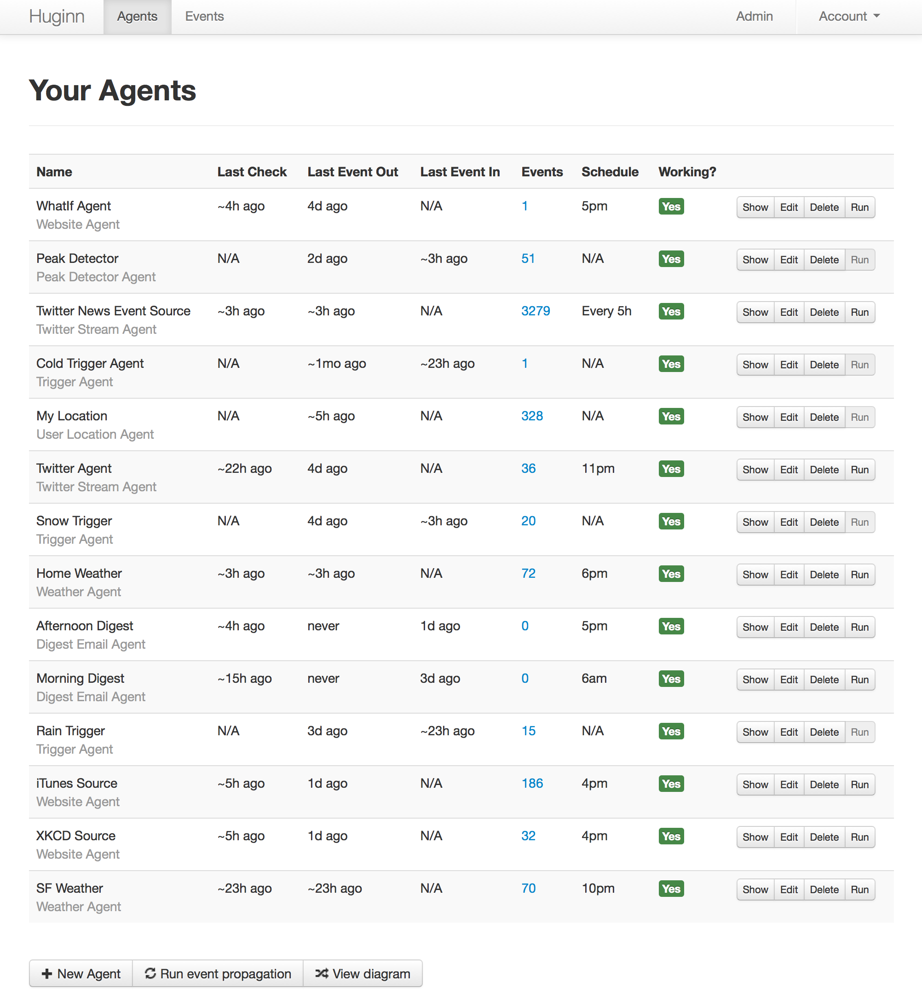

<!-- generated -->

# Huginn

1-Click installation template for Huginn on Easypanel

## Description

Huginn is a system for building agents that perform automated tasks for you online. They can read the web, watch for events, and take actions on your behalf.

## Instructions

Open Huginn from your domain, complete the initial account setup, then create or import agents and configure credentials for the external services they use.

## Benefits

- Automation: Automate repetitive tasks and workflows
- Customizable: Create custom agents for specific needs
- Data Integration: Connect and process data from multiple sources
- Self-Hosted: Keep your data private and secure

## Features

- Agent Creation: Build custom agents with a visual interface
- Web Scraping: Extract and process data from websites
- API Integration: Connect with various APIs and services
- Event Monitoring: Watch for and respond to events
- Data Processing: Transform and analyze data

## Links

- [Website](https://huginn.io/)
- [Documentation](https://github.com/huginn/huginn/wiki)
- [GitHub](https://github.com/huginn/huginn)
- [Template Source](https://github.com/easypanel-io/templates/tree/main/templates/huginn)

## Options

Name | Description | Required | Default Value
-|-|-|-
App Service Name | - | yes | huginn
App Service Image | - | yes | huginn/huginn:5dbeee394a982bd29ba63c06013cd9cb58191cc6

## Screenshots

## Change Log

- 2024-04-08 – First Release
- 2026-05-01 – Version bumped to 5dbeee394a982bd29ba63c06013cd9cb58191cc6

## Contributors

- [Ahson Shaikh](https://github.com/Ahson-Shaikh)
