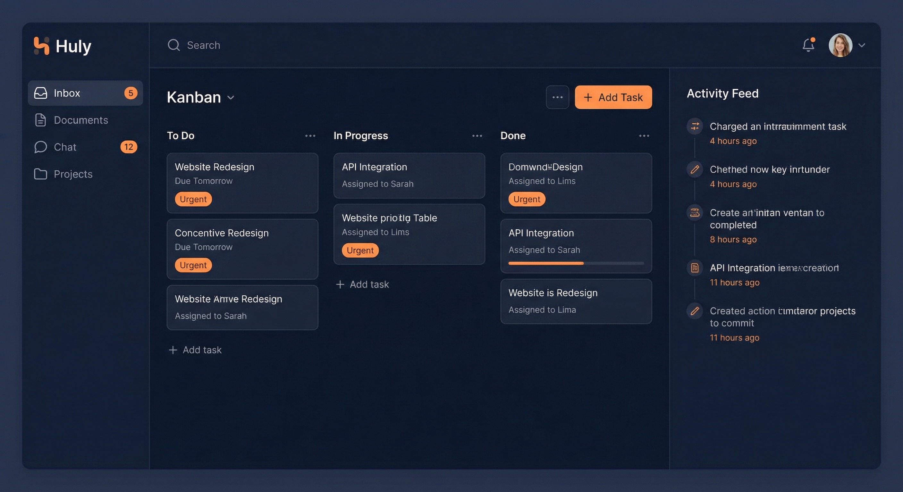
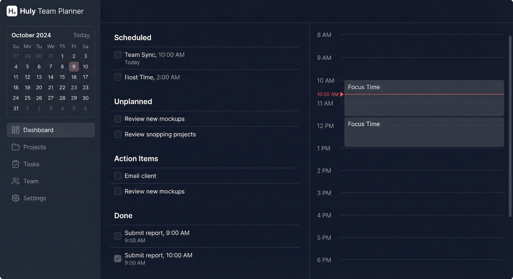
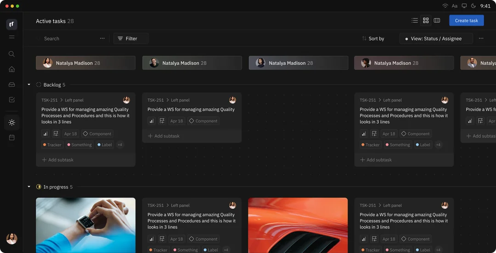

<!-- generated -->

# Huly

1-Click installation template for Huly on Easypanel

## Description

Huly is an all-in-one project management platform and self-hosted alternative to Linear, Jira, Slack, Notion, and Motion. It combines issue tracking, CRM, HRM, ATS (Applicant Tracking), chat, documents, and team collaboration in a single platform. Built on a robust framework for business applications, Huly offers real-time document collaboration with Y.js CRDT, full-text search via Elasticsearch, S3-compatible file storage with MinIO, and event-driven architecture with Redpanda (Kafka). Requires 2+ vCPUs and 8+ GB RAM minimum.

## Instructions

After deployment, access Huly via the main service domain. On first visit, click &quot;Sign up&quot; to create your account, then create a workspace. Email notifications (password recovery, etc.) are disabled by default—add the mail service and SMTP config for production. Allow ~60 seconds for all services to initialize on first startup.

## Benefits

- All-in-One Platform: Combined issue tracking, CRM, HRM, ATS, chat, documents, and team collaboration—replacing Linear, Jira, Slack, Notion, and Motion.
- Real-Time Collaboration: Y.js CRDT-based document editing with presence awareness. Multiple users edit simultaneously with automatic conflict resolution.
- Self-Hosted & Open Source: Full control over your data. EPL-2.0 licensed. Deploy on your own infrastructure with no vendor lock-in.
- Enterprise-Ready Architecture: CockroachDB for distributed SQL, Redpanda for event streaming, Elasticsearch for full-text search, MinIO for object storage.

## Features

- Issue Tracking: Kanban boards, sprints, custom fields, and workflows for project management. Jira and Linear alternative.
- CRM & Contacts: Customer relationship management with contacts, deals, and pipelines.
- HRM & ATS: Human resources and applicant tracking for recruitment workflows.
- Chat & Documents: Real-time chat and collaborative document editing with rich formatting.
- Full-Text Search: Instant search across projects, issues, documents, and chat via Elasticsearch.
- API & Integrations: Typed API client for programmatic access. Built-in integrations for Gmail, Calendar, Telegram.

## Links

- [Website](https://huly.io)
- [GitHub](https://github.com/hcengineering/platform)
- [Documentation](https://docs.huly.io)
- [Template Source](https://github.com/easypanel-io/templates/tree/main/templates/huly)

## Options

Name | Description | Required | Default Value
-|-|-|-
App Service Name | - | yes | huly
Huly Version | Use production tags (v*) from GitHub Releases | yes | v0.7.382
CockroachDB Image | - | yes | cockroachdb/cockroach:v24.2.10
MinIO Image | - | yes | minio/minio:RELEASE.2025-09-07T16-13-09Z
Enable Love (Audio & Video Calls) | Requires LiveKit Cloud or self-hosted LiveKit | no | false
LiveKit Host | e.g. wss://your-project.livekit.cloud (required when Love enabled) | no | 
LiveKit API Key | From LiveKit Cloud or your LiveKit server (required when Love enabled) | no | 
LiveKit API Secret | From LiveKit Cloud or your LiveKit server (required when Love enabled) | no | 

## Screenshots

## Change Log

- 2026-03-02 – v0.7.382 - Latest release
- 2026-02-09 – Optional Love service (audio/video calls) with LiveKit

## Contributors

- [Ahson Shaikh](https://github.com/Ahson-Shaikh)
