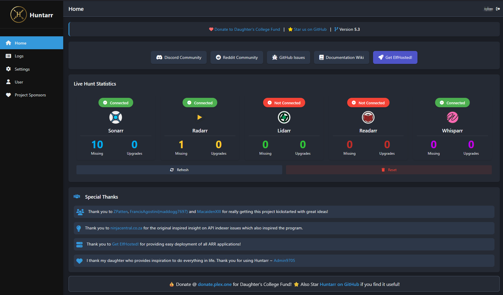

<!-- generated -->

# Huntarr

1-Click installation template for Huntarr on Easypanel

## Description

Huntarr is an automated media library enhancement tool that continuously monitors and improves your Radarr, Sonarr, and Lidarr collections. It works by periodically scanning your media libraries to identify missing items, failed downloads, and opportunities for quality upgrades, then automatically triggering searches to fill gaps and improve your collection. Huntarr acts as an intelligent automation layer on top of your existing *arr stack, ensuring your media library stays complete and up-to-date without manual intervention. The application features configurable scan intervals, customizable search triggers, support for multiple quality profiles, and detailed logging for tracking improvements. With its set-it-and-forget-it approach, Huntarr continuously works in the background to enhance your media collection by finding better quality versions, locating missing episodes or movies, and automatically requesting upgrades based on your configured quality preferences. The web interface provides visibility into scan history, search statistics, and library health metrics. Perfect for users who want their media libraries to automatically improve over time, home media server enthusiasts managing large collections, or anyone running Radarr/Sonarr/Lidarr who wants to ensure their libraries are always complete and optimized without constant manual searching.

## Benefits

- Automated Library Enhancement: Continuously improve your media collection without manual intervention by automatically triggering searches for missing items and quality upgrades.
- Set-It-and-Forget-It Operation: Configure once and let Huntarr work in the background, ensuring your media libraries stay complete and optimized 24/7.
- Quality Optimization: Automatically find and request better quality versions of your media based on your configured quality profiles and preferences.
- Multi-Service Support: Works seamlessly with Radarr, Sonarr, and Lidarr, providing comprehensive automation across your entire media stack.

## Features

- Continuous Library Scanning: Periodically scans your Radarr, Sonarr, and Lidarr libraries on a configurable schedule to identify improvement opportunities.
- Missing Item Detection: Automatically identifies missing movies, TV episodes, and music albums, then triggers searches to complete your collection.
- Quality Upgrade Automation: Monitors for higher quality versions of existing media and automatically requests upgrades based on your quality profiles.
- Failed Download Recovery: Detects failed or stalled downloads and automatically retriggers searches to ensure content acquisition completes successfully.
- Configurable Scan Intervals: Customize how frequently Huntarr scans your libraries to balance automation with system resource usage.
- Detailed Logging & Statistics: Track scan history, search triggers, and library improvements with comprehensive logs and statistics.

## Links

- [Website](https://huntarr.io/)
- [GitHub](https://github.com/plexguide/Huntarr.io)
- [Docker Hub](https://hub.docker.com/r/huntarr/huntarr)
- [Template Source](https://github.com/easypanel-io/templates/tree/main/templates/huntarr)

## Options

Name | Description | Required | Default Value
-|-|-|-
App Service Name | - | yes | huntarr
App Service Image | - | yes | huntarr/huntarr:9.2.1
Timezone | - | no | UTC

## Screenshots

## Change Log

- 2025-11-27 – Template Release

## Contributors

- [Ahson Shaikh](https://github.com/Ahson-Shaikh)
