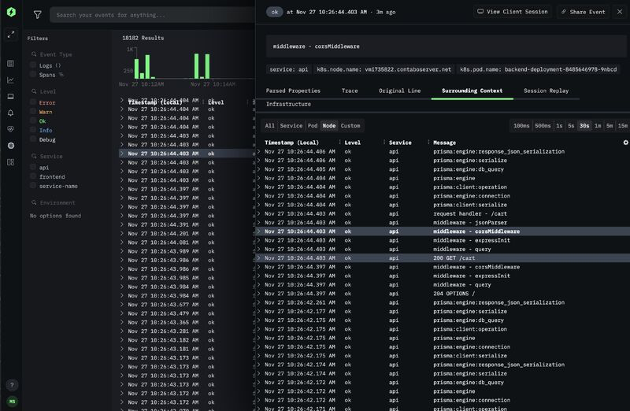

<!-- generated -->

# HyperDX

1-Click installation template for HyperDX on Easypanel

## Description

HyperDX is an open-source observability platform that unifies logs, metrics, traces, and session replays in one place. Built on ClickHouse for blazing-fast performance, it allows you to search terabytes of events in seconds without complex syntax. Perfect for debugging production issues, monitoring application performance, and correlating user sessions with backend traces. Recently acquired by ClickHouse to accelerate the future of open-source observability.

## Benefits

- Unified Observability: Correlate logs, metrics, traces, and session replays all in one platform without jumping between multiple tools.
- Blazing Fast Performance: Search terabytes of events in seconds, powered by ClickHouse database for exceptional query performance.
- Cost-Effective: Open-source solution that provides enterprise-grade observability without the high costs of proprietary tools like Datadog.

## Features

- Full-Text Search: Search across all your events without complex syntax. Find logs and spans with simple, intuitive queries.
- Session Replay: Automatically link user session replays with backend logs and traces for complete debugging context.
- OpenTelemetry Native: Built on OpenTelemetry standards for vendor-neutral instrumentation and easy migration from existing observability tools.
- Real-Time Monitoring: Live tail logs, create alerts, and visualize metrics in real-time with intuitive dashboards and chart builders.

## Links

- [HyperDX Official Site](https://www.hyperdx.io/)
- [Documentation](https://www.hyperdx.io/docs)
- [GitHub Repository](https://github.com/hyperdxio/hyperdx)
- [Template Source](https://github.com/easypanel-io/templates/tree/main/templates/hyperdx)

## Options

Name | Description | Required | Default Value
-|-|-|-
App Service Name | - | yes | hyperdx
App Service Image | - | yes | docker.hyperdx.io/hyperdx/hyperdx-local:2-beta
Expose ClickHouse HTTP Port (8123) | Expose ClickHouse HTTP interface for direct database access and queries | no | 8123
Expose OpenTelemetry gRPC Port (4317) | Expose OpenTelemetry gRPC endpoint for receiving telemetry data from applications | no | 4317

## Screenshots

## Change Log

- 2025-07-01 – Initial release

## Contributors

- [Ahson Shaikh](https://github.com/Ahson-Shaikh)
