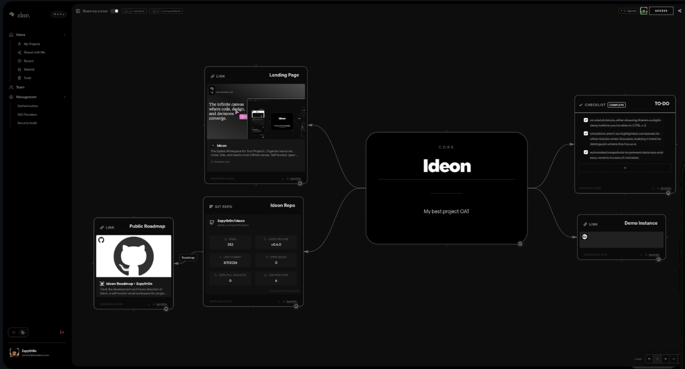

<!-- generated -->

# Ideon

1-Click installation template for Ideon on Easypanel

## Description

Ideon is a self-hosted visual workspace that lets teams organize repositories, notes, links, and files on an infinite collaborative canvas. It combines spatial organization with real-time sync so project context stays visible and connected.

## Instructions

Deploy the template and wait for the database and app services to start, then open the app URL and create your account. Check the documentation for further configurations

## Benefits

- Spatial Project Context: Organize related work on an infinite canvas instead of splitting context across disconnected tabs and tools.
- Collaborative by Default: Share workspaces with teammates and collaborate in real time on project planning and documentation.
- Self-Hosted Data Control: Run the full stack in your own infrastructure with persistent storage and PostgreSQL-backed state.

## Features

- Infinite Canvas Workspace: Place notes, repositories, links, and files visually to mirror how your team thinks about projects.
- Git Provider Integrations: Connect to GitHub, GitLab, and other providers to bring repository context directly into your workspace.
- Persistent Storage: Preserve workspace data and uploads across updates through mounted persistent volumes.

## Links

- [Website](https://theideon.com/)
- [Documentation](https://github.com/3xpyth0n/ideon#readme)
- [GitHub](https://github.com/3xpyth0n/ideon)
- [Template Source](https://github.com/easypanel-io/templates/tree/main/templates/ideon)

## Options

Name | Description | Required | Default Value
-|-|-|-
App Service Name | - | yes | ideon
App Service Image | - | yes | ghcr.io/3xpyth0n/ideon:v0.7.7

## Screenshots

## Change Log

- 2026-03-31 – Initial template release

## Contributors

- [Ahson Shaikh](https://github.com/Ahson-Shaikh)
